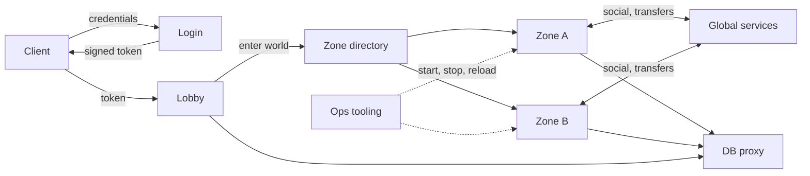
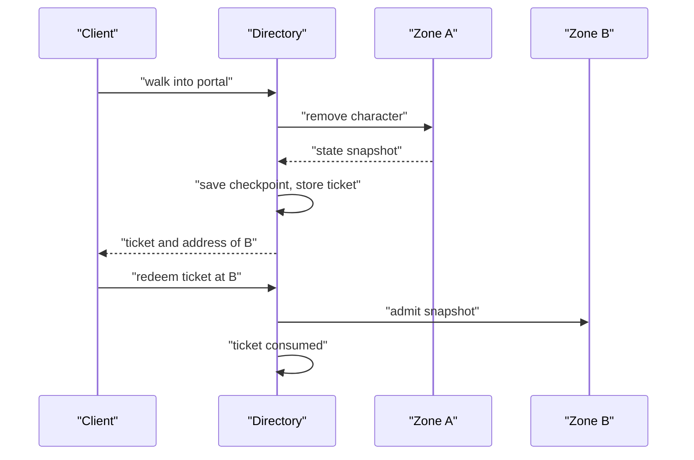
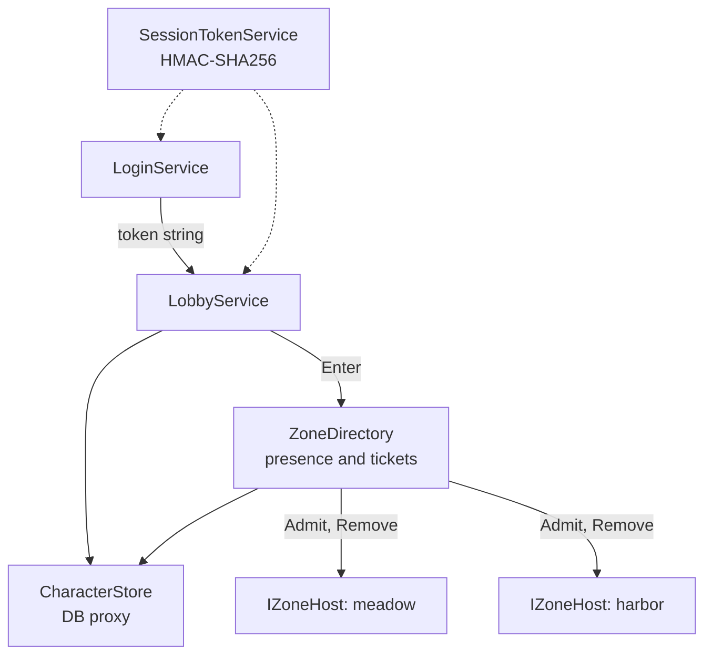

# Module 19: MMO server architecture

- **Goal:** explain why an online RPG is split into several server processes, which topologies exist and when each fits, how a player is handed from one process to the next safely, and how to start with a modular monolith whose boundaries already match the future split; then build a small in-process model of login, lobby, zone routing and zone transfer.
- **Prerequisites:** [03: The game loop and time](03-game-loop.md) (a zone is one tick loop), [01: What a game engine is, and build vs buy](01-engine-build-or-buy.md).
- **Example:** `examples/19-topology/` (`dotnet test examples/19-topology`)
- **Facts checked:** October 2026 (prices, licences and product status change; re-check before reuse)

## In short

A persistent online game is not one program. It is a set of processes with different jobs: logging players in, letting them pick a character, simulating a map, running chat and parties across maps, talking to the database, and keeping the fleet healthy. Splitting them isolates failures, lets each part scale on its own, and keeps each tick loop small. The price is that state now crosses process boundaries, and every crossing (a login, a zone change) can fail half way. The design space runs from a single process to seamless shared worlds; engines give you none of the account, directory or transfer parts, and hosting services give you machines, not the design. For a small team the verdict is a **modular monolith first**: separate services behind interfaces and message-shaped calls, in one process, so splitting later is a deployment change and not a rewrite. The example does exactly that: signed short-lived tokens, a lobby, a zone directory and a one-time-ticket zone transfer, with 28 tests.

## 1. The concept

### 1.1 Why split at all

One process can run a small game. An MMO outgrows it for four reasons:

- **CPU.** A zone simulates every entity every tick (module 03). One thread per zone is the usual rule, so the number of zones you can run is the number of cores you can use.
- **Failure isolation.** A crash in one map should not log out everyone else. A crash in the chat code should not stop combat.
- **Independent scaling.** Login peaks when a patch lands. Zones peak around events. Chat grows with population. Separate processes scale separately.
- **Independent deployment.** Fixing the lobby should not restart the world.

### 1.2 The usual roles

| Role | Job | State it owns |
|---|---|---|
| Login / auth | Check credentials, issue a session token | Accounts, bans |
| Lobby / character select | List and create characters, pick one, choose a zone | Nothing live; reads characters |
| Zone / world | Simulate one map or instance at a fixed tick | All live state of characters in it |
| Global services | Whisper, who-list, party, guild, auction: anything that crosses zones | Social graphs, presence index |
| Database proxy | The only code that touches the database | Persisted data |
| Ops | Deploy, start and stop, logs, metrics, alarms | Fleet configuration |

### 1.3 Session hand-off with tokens

The client talks to several servers in turn. Each must trust that the previous one authenticated the player, without calling it on every request. The standard answer is a **signed token**: the login service writes the claims (account, expiry) and signs them with a secret; later services verify the signature locally. HMAC with a shared key is the simplest form; public-key signatures let verifiers hold only a public key. Three rules matter:

- **Short lived.** Minutes, not days. A stolen token then expires quickly.
- **Verified in constant time.** Comparing signatures with an ordinary equality check can leak how many bytes matched.
- **Bound to what it grants.** A token proves an account. It must not let that account pick someone else's character; the next service checks ownership.

### 1.4 Zone transfer

Walking through a portal means leaving one simulation and joining another, possibly on a different machine. The dangerous moment is in between. Two failures define the design:

- **Duplication.** The character exists in both zones, so items can be duplicated.
- **Loss.** The character exists in neither, and its progress is gone.

The safe sequence is: detach from the source and **checkpoint** the state; hand a **one-time transfer ticket** to the client; the destination admits the character when the ticket is redeemed. The ticket expires, so a client that never arrives does not hold the character hostage. Until redemption the character is in no zone, and the system treats it as online, so no second login can sneak in.

### 1.5 Channels and instances

A **channel** is a copy of the same open-world map run by another zone process, to cap crowd size. An **instance** is a private copy for a party, created on demand and thrown away when empty. Both are "more zone processes of the same map"; the directory picks which copy a character enters. The routing rule is the same as in 1.4.

### 1.6 Modular monolith or microservices

A **microservice** design runs each role as its own deployed service from day one. A **modular monolith** runs them in one process, but each role is a module with a narrow interface and no access to another module's data. The second is cheaper to build, debug and test, and a clean module boundary becomes a process boundary later with little change. The risk is discipline: a monolith without enforced boundaries becomes tangled, and splitting it is then a rewrite.

## 2. The design space

### 2.1 World topology

| Topology | What it is | Fits | Cost |
|---|---|---|---|
| **Single process** | Everything in one program | Prototypes, small co-op games | Does not scale; one crash ends everything |
| **Match-based (session servers)** | A matchmaker starts a dedicated server per match or party and discards it afterwards | Action RPG co-op, MOBAs, shooters, dungeon runs | No persistent shared world; needs a fleet scheduler |
| **Zone servers with a directory** | One process per map or instance type; a directory routes players | Classic MMOs and zone-based online RPGs | Transfers between zones are the hard part |
| **Hub plus instances** | A shared social hub (many channels) and private instanced content | Many modern online RPGs, mobile RPGs | Simple per instance; a hub still needs crowd caps |
| **Seamless shared world** | One continuous map split spatially across servers, with border handoff | Very large open worlds | Entities near a border live on two servers; hardest to build; few teams need it |

### 2.2 How a player moves between processes

| Method | How | Trade-off |
|---|---|---|
| **Reconnect** | The client is told a new address, drops its connection, connects and authenticates again; the server guards the gap with a grace period | Simple; the character vanishes for the length of a reconnect, and the server must trust a timeout rather than proof of arrival |
| **Ticketed transfer** | Detach, checkpoint, one-time ticket, admit (this module's example) | Provable "never in two places"; needs durable checkpoints |
| **Live handoff** | Source streams state to the destination while the client keeps one connection through a gateway | Smoothest for the player; most complex; needed for seamless worlds |

### 2.3 Where does cross-zone state live?

| Option | Idea | Trade-off |
|---|---|---|
| **A global hub process** | One process knows who is online and where, and relays whispers, parties and moves | Simple and consistent; a hub every zone depends on |
| **Shared database or cache** | Presence and social data in a store everyone reads | Scales with the store; slower, and consistency is eventual |
| **Publish/subscribe bus** | Services publish events; others subscribe | Decoupled; harder to reason about ordering |

### 2.4 How to choose

| If you are building... | Use |
|---|---|
| A co-op action RPG with parties of 1 to 4 | Match-based or hub plus instances; no zone transfer inside the world |
| A classic persistent online RPG | Zone servers, a directory, ticketed transfers |
| A mobile RPG with a lobby feel | Hub plus instances, with a modular monolith behind it |
| A single-character action game with large maps | Hub plus instances, or zone servers; avoid seamless unless the design needs it |
| A game with parties of several characters per player | The same topologies; a party is just several characters moved together, so a transfer must move all of them as one unit |

## 3. Trade-offs and pitfalls

- **Operational complexity.** Many process types each have their own start order, configuration and failure behaviour. A fleet you cannot start by hand needs tooling from day one.
- **A hub every zone depends on.** If one service holds who-is-online and routes everything, its state must agree with the zones and the database, and its outage is everyone's outage.
- **Reconnect gaps.** Moving by reconnect makes the character disappear for a moment, and a timeout is weaker than a ticket that proves a legitimate arrival.
- **One shared database.** If every process reaches the same store, the database, not the process split, sets the real scaling limit (module 20).
- **No schema discipline between servers.** Fixed binary structs and a hand-kept version number make independent deployment of two servers risky.
- **Splitting too early.** Network calls replace method calls, and every call can now fail or be slow. Split only when you can name the measured need.
- **Crash between two steps.** The hard bugs are the ones where a process dies halfway through a transfer or a purchase. Write the recovery rule for each step, and test it.
- **Tokens: long lives, plain comparison, no ownership check.** Each is a classic security hole.

## 4. Build or buy

**What engines give you.** Unreal, Unity and Godot each ship a networking layer for gameplay replication between a client and a server, and some support dedicated server builds. None of them ships a login service, a lobby, a zone directory, cross-zone chat, a database layer or fleet management. As of October 2026 this is the design you own whichever engine you pick.

**What services give you.**

| Service | What it provides | What it leaves to you |
|---|---|---|
| Nakama (open source, self-hostable or hosted) | Accounts, sessions, social graph, chat, matchmaking, storage | The authoritative zone simulation |
| PlayFab (Microsoft, hosted) | Accounts, economy, analytics, multiplayer server hosting | Zone simulation; lock-in to the platform |
| GameLift, Agones (Kubernetes) | Starting, scaling and placing game server processes | What runs inside them, and the directory logic |

These cover the generic parts (accounts, chat, fleets of servers). A hosting layer gives you machines; the character state, the zone directory and the transfer protocol are still yours.

**Could we build it ourselves?**

| Piece | Effort | Risk |
|---|---|---|
| Signed tokens (HMAC) | Hours; standard library | Low, if verification is constant time and tokens are short lived |
| Lobby and character store | Days | Low |
| Zone directory and presence | Days | Medium: the invariant "never in two zones" is easy to break at the edges (crash mid transfer) |
| Ticketed zone transfer | Days for in-process, weeks across machines | Medium to high: needs durable checkpoints and a recovery rule for lost tickets |
| Cross-zone social services | Weeks | Medium: consistency with the directory |
| Fleet tooling, logs, metrics | Weeks; use Kubernetes, container tooling and standard observability stacks | Low to medium, since the building blocks are open |
| Hot reload of game data | Days if data is files read at runtime | Low |

AI-assisted development helps most where the work is well-known and specifiable: token handling, state machines, tests of invariants, deployment manifests. It helps least with the part that is hard in an MMO: reasoning about what happens when a process dies between two steps. That needs a written recovery rule for each step and a test for it.

**What a PoC must prove.** (1) A character survives a transfer with all state intact, and survives a crash at each step with either its old or its new state, never both and never neither. (2) The directory's view stays right when a zone process dies and restarts. (3) The split can be made later without changing callers: run the same module once in-process and once behind a network call, with the same tests.

**Verdict: build, as a modular monolith with clear boundaries first.** Use open components for the generic parts (a container platform for process management, a standard observability stack, a hosted or self-hosted service like Nakama if you do not want to write accounts and chat). Keep the zone directory, the character state and the transfer protocol in your own code; they are the game's core rules. Split into separate processes only when a measured need appears: a zone that saturates a core, a service that must deploy independently, or a failure that must not spread.

## 5. The example

### 5.1 Design

The example is a single process containing the roles of section 1.2 as separate classes. They only meet through narrow types: a token string, plain record snapshots, and the `IZoneHost` interface. That is what makes each one splittable later: replace the in-process call with a network call and the callers do not change.

Two design choices carry the safety:

1. **Presence lives in one place.** The directory holds the map from character to zone, and the set of pending tickets. A character with a pending ticket counts as online, so a second `Enter` is refused. "Never in two zones" becomes one check in one class.
2. **Detach, checkpoint, then admit.** `BeginTransfer` removes the character from the source zone and saves it to the store before it issues the ticket. If the ticket expires, the saved state is the source state and the player simply logs in again.

The knobs are data: the token life (60 seconds in the tests), the ticket life (20 seconds), each zone's name, spawn point and capacity. A game with instances registers more `IZoneHost` objects for the same map.

### 5.2 Walkthrough

Project `M19.Topology.csproj`; one public type per file.

- `SessionTokenService.cs`: the token is `base64url(account|expiry).base64url(HMAC-SHA256)`. `Validate` returns `Malformed`, `BadSignature` or `Expired`, and compares signatures with `CryptographicOperations.FixedTimeEquals`.
- `LoginService.cs`: checks a password hash and issues a token with a configurable life. It knows nothing about characters.
- `CharacterStore.cs`, `CharacterState.cs`: the database proxy as an in-memory store, and the record (level, HP, gold, zone, position) that must survive a transfer.
- `LobbyService.cs`: validates the token, lists the account's characters, refuses a character that belongs to another account.
- `IZoneHost.cs`, `ZoneHost.cs`: a zone's side of the boundary: `Admit`, `Remove`, a spawn point and a capacity. `ZoneHost` also holds live state that gameplay changes (`ApplyDamage`, `MoveTo`).
- `ZoneDirectory.cs`: `Enter`, `Logout`, `BeginTransfer`, `CompleteTransfer`, `ExpireTransfers`. Ticket ids come from an injected seeded `Random` (a real server would use a cryptographic generator), and time from an injected `IClock`.
- `ManualClock.cs`: a clock that only moves when told to, so expiry is tested without waiting.

### 5.3 Key tests, with concrete numbers

- **A token expires on the exact second** (`TokenTests.Validate_AfterTtl_ReturnsExpired`): a token issued at second 1000 with a 60 second life is valid at 1059 and `Expired` at 1060.
- **A tampered token is rejected** (`TokenTests`): a payload for one account paired with another account's signature gives `BadSignature`, as does a single flipped signature character; `a.b.c` and `!!!.???` are `Malformed`; a token signed with another key is `BadSignature`.
- **Ownership is enforced** (`LobbyTests.EnterWorld_AnotherAccountsCharacter_IsRefused`): account "mira" asking for account "ned"'s character 3 gets `NotYourCharacter`, and character 3 stays offline.
- **A ticket works once** (`TransferTests.CompleteTransfer_SameTicketTwice_SecondIsRejected`): the first redemption is `Ok`; the second is `InvalidTicket` and the destination still holds exactly one character. A replay after the character has moved on again also fails, leaving the destination empty.
- **A ticket expires** (`CompleteTransfer_AfterTwentySeconds_IsExpiredAndCharacterIsInNoZone`): after 20 seconds the ticket is `Expired`, the character is in no zone, and its stored zone is still "meadow".
- **Never in two zones** (`PresenceTests`): a second `Enter` gives `AlreadyOnline`; during a transfer the character is in 0 zones and `Enter` is still refused; across four back-and-forth transfers it is in exactly 1 zone after each completion and 0 between.
- **State is preserved** (`TransferTests.Transfer_PreservesLevelHpAndGold`): a level 30 character with 900 HP and 120 gold takes 250 damage, transfers, and arrives with 650 HP, 120 gold and level 30 at the destination's spawn point (500, 40). The arrival is also checkpointed: the store shows 650.
- **Destination full** (`CompleteTransfer_DestinationFull_KeepsTicketForRetry`): `ZoneFull` leaves the ticket valid; after a slot frees, the same ticket succeeds.

### 5.4 What the example deliberately leaves out

- **No network.** Services are called as methods. The point is the boundaries; a split would put a transport behind `IZoneHost` and the directory's calls. Module 17 covers the transport.
- **No crash recovery.** If the directory process dies while tickets are pending, they are lost. A real system writes pending transfers durably and reconciles at start (module 20).
- **No distributed presence.** One directory instance. Running several needs shared presence (a database row or a lock service) with the same single-owner rule.
- **No channels or instances.** They are more `IZoneHost` objects for the same map; the directory would choose among them.
- **Party transfer.** One character moves at a time; moving a party as a unit is a loop over the same steps with an all-or-nothing rule.
- **Token hygiene.** One shared key, no rotation, no revocation list, a plain hash for passwords. All three are needed in production (module 21).
- **No ops tooling.** Deployment, metrics, log shipping and hot reload are covered in the text only; they depend on the platform you deploy to.

## Key takeaways

- A persistent online game is a set of processes with distinct jobs: login, lobby, zones, global services, a database proxy, and ops. The split buys failure isolation, independent scaling and small tick loops.
- Choose the topology by game type: match-based for co-op, zone servers with a directory for classic MMOs, hub plus instances for most modern online RPGs, seamless only if the design demands it.
- The price is that state crosses process boundaries; every crossing needs a rule for what happens if it fails half way.
- Signed, short-lived tokens let a service trust a login without calling it; verify in constant time and check ownership separately.
- A safe zone transfer is detach, checkpoint, one-time ticket, admit. Presence is owned in one place so a character is never in two zones.
- Engines do not provide this; services such as Nakama, PlayFab, GameLift and Agones cover accounts, chat and hosting but not your zone and transfer rules.
- Build a modular monolith first, with boundaries that match the future split, and separate processes only when measurement demands it. The example proves the rules by test: a token expires at second 1060, a ticket works once, a 900 HP character arrives with 650 HP after a hit of 250.

## Further reading

- Microsoft Learn, [*Modular monolith vs microservices guidance*](https://learn.microsoft.com/en-us/azure/architecture/microservices/) (architecture centre).
- Heroic Labs, [*Nakama documentation*](https://heroiclabs.com/docs/nakama/).
- Agones, [*Dedicated game server hosting on Kubernetes*](https://agones.dev/site/docs/).
- Amazon, [*Amazon GameLift documentation*](https://docs.aws.amazon.com/gamelift/).
- RFC 2104, *HMAC: Keyed-Hashing for Message Authentication*.
- Martin Kleppmann, *Designing Data-Intensive Applications*, chapters on replication and distributed transactions.
