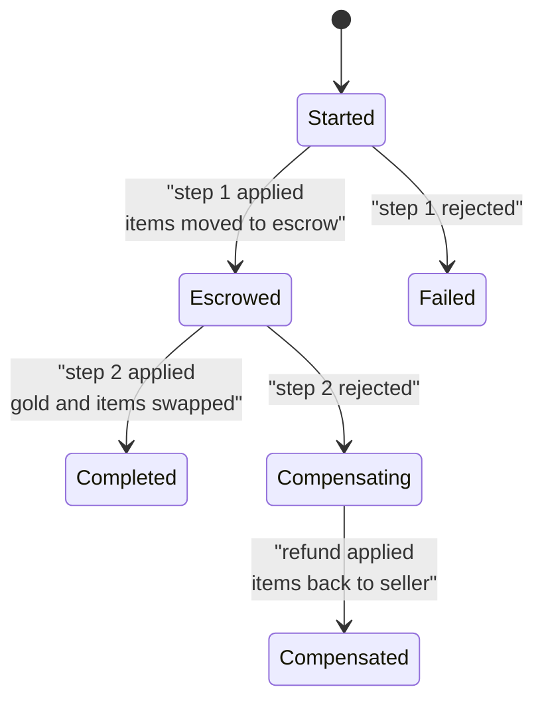
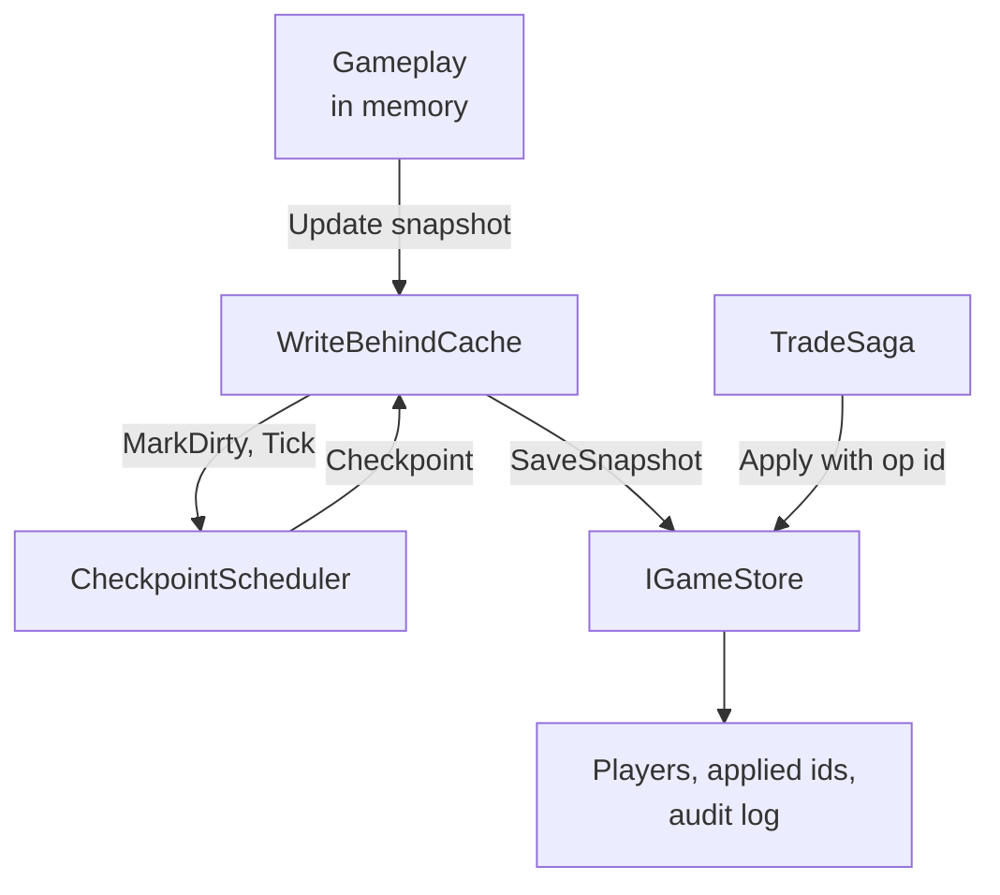

# Module 20: Persistence and transactions

- **Goal:** decide what an online game keeps in memory and what it writes to a database, when it writes, and how to change valuable data (items, currency) so that a crash, a retry or a failed second step can never duplicate or destroy it; then build a small store with atomic transactions, idempotent operations, checkpoints and a compensating trade.
- **Prerequisites:** [03 Game loop and time](03-game-loop.md) (ticks as the clock), [14 Items, economy and rewards](14-items-economy.md) (the ledger idea), [19 MMO server architecture](19-server-architecture.md) (which process owns which data).
- **Example:** `examples/20-persistence/` (`dotnet test examples/20-persistence`)
- **Facts checked:** October 2026 (prices, licences and product status change; re-check before reuse)

## In short

A running game keeps almost everything in memory, because a database is far too slow for a simulation that ticks 10 to 20 times per second. The database is where state survives **crashes, restarts and logouts**, and where the valuable facts (who owns which item, how much gold) are made trustworthy. Two kinds of data therefore need two kinds of saving: cheap, frequent state (position, experience) is saved at **checkpoints**; valuable state is changed in **transactions** that are all-or-nothing and safe to retry. The main design choices are how much you can afford to lose, where the rules live (SQL or application code) and how multi-step changes recover from a crash. The example shows an atomic `Apply` with an operation id, an audit log written in the same commit, a tick-based checkpoint scheduler, and a two-step trade saga that survives a crash at every step.

## 1. The concept

### 1.1 Memory is the working copy, the database is the record

While a player is online, the zone server holds their character in memory and changes it hundreds of times per second. Writing each change to a database would be a thousand times too slow, so a game uses its database differently from a web application:

| | In memory (hot) | In the database (durable) |
|---|---|---|
| Holds | Everything about online players, monsters, the current zone | Accounts, characters, inventories, quest progress, mail, market, logs |
| Speed | Nanoseconds | Milliseconds |
| Survives a crash | No | Yes |
| Source of truth for | What is happening right now | What the player owns when not playing, and after a restart |

The design question is never "memory or database?" but **"how much can we afford to lose, and how often must we write?"**

### 1.2 Two kinds of data

- **Cheap state:** where the character stands, current HP, experience gained in the last minute. Losing a few minutes of it annoys but does not break the economy.
- **Valuable state:** items, gold, cash-shop purchases, level-ups, quest rewards. Losing it is a refund ticket; **duplicating** it is an economy-wide exploit.

The first kind is saved at **checkpoints**. The second is changed through **transactions**, usually the moment it happens.

### 1.3 Save cadence: when to write

A checkpoint is a saved snapshot of a player. Typical triggers:

| Trigger | Why |
|---|---|
| **Interval** (every few minutes of ticks, only if something changed) | Bounds how much a crash can lose |
| **Zone change** | The player crosses a process boundary; the next zone loads from the database |
| **Logout or disconnect** | The last chance before the memory copy is dropped |
| **Important event** (level-up, rare drop, quest reward) | Too painful to lose, too rare to be costly |

Two refinements. Do not write players who have not changed, and **spread** the interval writes (each player's clock starts at their own login) so that 5,000 players do not all hit the database on the same tick.

### 1.4 Write-behind

**Write-behind** (also called write-back) means gameplay updates a cache in memory and a later step writes the cache to the database. It turns a thousand small updates into one write and keeps database latency off the tick. The price is a **loss window**: whatever changed since the last checkpoint is gone if the server dies. That window is a decision you make, not an accident, and the triggers above are how you shrink it where it hurts.

### 1.5 Transactions and ACID

A **transaction** groups several changes so that they all happen or none does. Four properties are usually listed (ACID): **atomic** (all or nothing), **consistent** (rules such as "gold is never negative" always hold), **isolated** (concurrent transactions do not see each other half-done), **durable** (once committed, it survives a crash). A trade that removes a sword from one player and adds it to another needs this: a crash between the two halves must not leave the sword in both inventories, or in neither.

### 1.6 Idempotency

A message can be repeated: a client resends after a timeout, a queue redelivers after a restart, a script runs twice. An operation is **idempotent** when doing it twice has the same effect as doing it once. The standard technique is an **operation id**: the caller invents a unique id for the intent ("trade t1, step settle"), the database records the id in the same transaction as the change, and a second attempt with the same id is recognised and skipped. The id comes from the caller, not from the database, so that the caller can retry without knowing whether the first attempt arrived.

### 1.7 Stored procedures or application transactions

| | Logic in stored procedures | Logic in the application, database as storage |
|---|---|---|
| Round trips | One call per action | Several, unless batched |
| Rules live in | SQL, next to the data | C#, with the rest of the game |
| Testing and review | Needs a database; harder to unit test | Plain unit tests against a fake store |
| Changing a rule | Deploy to the database | Deploy the server |
| Fits | A DBA-run shop, very tight latency | Teams that want one language and fast tests |

Neither is wrong. What matters is that valuable changes are **one transaction with its validation inside it**, wherever that code lives.

### 1.8 Sagas: multi-step changes with compensation

Sometimes one transaction cannot cover the whole operation: the steps span two databases, two services, or two moments in time (escrow now, settle after the other side confirms). A **saga** is a sequence of local transactions where each step has a **compensating step** that undoes it in business terms, and where the saga's own progress is stored so that a crash can be recovered.



Rules that make a saga safe: every step has a fixed operation id (so repeating it is harmless), the progress marker is saved after each step, and recovery is just "read the marker and continue".

### 1.9 Audit and event logs

An **append-only log** records every important change as a fact: who, what, when, why. It is cheap to write in the same transaction as the change, and it answers the questions support and security ask all the time ("where did this sword come from?"). It is not a cache you read in gameplay; it is evidence.

### 1.10 Schema evolution

A game that runs for years changes its data model constantly. The safe habit is **additive migrations**: add a column with a default, back-fill, switch the code, and only much later drop the old column. Keep migrations in version control, run them in order, and keep the things that must not change (ids, ownership) apart from those that will (tuning, flags). A flexible "property bag" table (name, value) is a common escape hatch, with a cost: no types, no foreign keys.

## 2. The design space

### 2.1 How much to keep in memory

| Option | How it works | Typical fit | Cost |
|---|---|---|---|
| **Write-through** | Every change goes to the database at once | Cash shops, auctions, small turn-based or social games with few changes per second | Database latency on every action; heavy load |
| **Write-behind with checkpoints** | Memory is the working copy; snapshots are saved on a schedule and at key moments | Real-time RPGs and MMOs | A bounded loss window after a crash |
| **Event sourcing** | Store the stream of events; rebuild state by replaying | Economies that need a full history, games with replays | Replay time, schema changes over old events |
| **Client-side save** | The player's device holds the save | Single-player and offline games | Trivially editable; not usable for shared economies |

### 2.2 What one save contains

- **A single-character action RPG** saves one character record: stats, inventory, quest flags.
- **A party or squad game** saves several characters that share an inventory, a pet or a roster. Save the whole group as one unit, or at least in one transaction, so a crash cannot leave one member levelled and another not.
- **A shared-world game** adds data that belongs to no single player: guilds, market listings, mail. These need the strictest rules because two players touch the same row.

### 2.3 Where the rules live

The comparison in section 1.7 (stored procedures versus application transactions) is the main architectural choice. Small teams with one language usually keep rules in application code and use database constraints as a safety net.

### 2.4 How to choose

| If your game... | Prefer |
|---|---|
| Is real-time with a persistent world | Write-behind checkpoints for cheap state, transactions for valuable state |
| Has a player-to-player economy | A ledger with operation ids and an audit log from day one |
| Has several characters per player | Save the group atomically; treat the roster as one record |
| Spans services or databases | Sagas with compensation instead of one big transaction |
| Is single-player or offline | A local save file, with an integrity check if you care |

## 3. Trade-offs and pitfalls

- **The loss window.** Longer checkpoint intervals reduce load but lose more on a crash. Shrink the window only for events that hurt (level-ups, rare drops).
- **Thundering herd.** Saving every player on the same tick overloads the database. Spread the clocks.
- **Valuable changes through the cache.** If gold or items can change through the write-behind path, a crash can duplicate or lose them. Give valuable changes their own door.
- **Duplication on retry.** A message resent after a timeout applies twice unless operations carry an id. This is the most common source of item duplication exploits.
- **Partial multi-step operations.** A crash between two steps leaves half a trade. Use a saga with a stored progress marker, or one transaction if the data lives together.
- **Rules scattered in SQL.** Hundreds of procedures with repeated checks are hard to test and easy to leave inconsistent: old and hardened versions of the same rule live side by side.
- **Unrecorded history.** Without an audit log you cannot find who used an exploit or refund fairly.
- **Hard migrations.** Dropping or renaming columns in a live game breaks old servers during a rolling deploy. Use additive migrations.

## 4. Build or buy

**What engines give you.** Unreal, Unity and Godot give you nothing here. They offer local save files for single-player games and nothing for a persistent online world. Persistence is entirely your server's job.

| Option | What you get | What it costs you |
|---|---|---|
| **PostgreSQL** with Npgsql, plus Dapper (thin SQL mapper) or EF Core (full ORM with migrations) | A proven transactional database: ACID, constraints, row locks, `INSERT ... ON CONFLICT`, JSON columns, replication; free and open source | You design schema, transactions and migrations |
| **Backend-as-a-service** (PlayFab, Nakama and similar, as of October 2026) | Player accounts, inventory, currency and cloud-save APIs, sometimes with server-side scripting | Their data model, per-request or per-user pricing, and less control over multi-step rules; verify current terms before relying on them |
| **Key-value or document stores** (Redis, MongoDB) | Fast reads for sessions and caches; flexible shapes | Weaker multi-record transactions; Redis is a cache and queue, not a ledger of record |

**Could we build it ourselves?** Yes, and it is mostly design discipline, not volume of code.

| Piece | Effort | Risk |
|---|---|---|
| Schema and migrations (EF Core or SQL scripts) | Medium | Low; additive migrations avoid most pain |
| Transactional ledger with operation ids | Low | Medium: it must be the only way valuable data changes |
| Checkpoint scheduler and write-behind | Low | Low: the loss window is a product decision |
| Async persistence worker off the tick thread | Medium | Medium: ordering per player, back-pressure |
| Sagas with recovery | Medium | Medium: needs failure-injection tests |
| Audit log | Low | Low |

**What a proof of concept must prove.** (1) Killing the server process at a random moment during a load test of trades never creates or destroys an item or a coin; a nightly total-conservation check passes. (2) Retrying every operation twice changes nothing. (3) With 1,000 simulated players, checkpoint writes stay within the database's budget and are spread over time. (4) A restart recovers every in-flight saga to a final state. (5) Restoring last night's backup plus the log reproduces the same totals.

**Verdict: build on PostgreSQL.** Use Npgsql with either Dapper or EF Core, keep valuable changes in one transactional ledger path, and write the rules in application code with database constraints as a safety net. Consider a backend service only for what is not your core (for example storefront receipts or cross-title accounts), and always keep the ledger rules you own.

## 5. The example

### 5.1 Design



The store has two doors on purpose. **Snapshots** (cheap state) go through the cache and checkpoints. **Valuable changes** go through `Apply`, never through the cache.

### 5.2 Walkthrough

- **`IGameStore.cs`**: the whole persistence surface the game needs. `Apply(opId, kind, changes)` is the only way to change gold or items. A PostgreSQL class would implement the same interface.
- **`PlayerRecord.cs`, `Change.cs`**: immutable data. A transaction builds new versions and never edits committed ones.
- **`InMemoryGameStore.cs`**: `Apply` stages every change in a private workspace, validates (no negative gold, no negative item count, known player), and only then swaps the staged records in together with the operation id and the audit entry. If anything throws before that commit point, the store is untouched. This mirrors what a database transaction does for you.
- **`ApplyResult.cs`**: `Applied`, `Duplicate` (already done earlier: a success) or `Rejected` (with a reason).
- **`CheckpointScheduler.cs`**: counts ticks; interval, zone change, important event and logout checkpoints; clean players produce nothing.
- **`WriteBehindCache.cs`**: the hot copy of each online player's snapshot, saved when the scheduler says so.
- **`TradeSaga.cs`**: the two-step trade with its progress marker.
- **`schema.sql`**: the PostgreSQL equivalent of everything above.

The core of idempotent apply is only a few lines:

```csharp
if (_applied.Contains(opId)) return new(ApplyOutcome.Duplicate);   // same intent again: do nothing
// ... stage and validate every change ...
foreach (var (id, record) in staged) _players[id] = record;         // commit point
_applied.Add(opId);
_log.Add(new LogEntry(_log.Count + 1, opId, kind, changes.ToArray()));
```

The saga's recovery loop reads the stored status and continues:

```csharp
case SagaStatus.Escrowed:
    var r2 = _store.Apply($"{orderId}:settle", "trade.settle", [...]);
    saga = Save(saga, r2.Ok ? SagaStatus.Completed : SagaStatus.Compensating);
```

Because `Apply` ignores repeated ids, running this step again after a crash between the apply and the status save is harmless.

### 5.3 The PostgreSQL version

`schema.sql` shows the same design in SQL:

- **`applied_operations`** has the operation id as its primary key. `INSERT ... ON CONFLICT DO NOTHING` followed by `IF NOT FOUND` is the idempotency check, and it stays correct even with two servers racing.
- **Validation lives in the `UPDATE`**: `UPDATE players SET gold = gold - p_price WHERE id = p_buyer AND gold >= p_price`. If no row matches, the buyer cannot pay. This is one atomic statement, so there is no read-then-write race. A `CHECK (gold >= 0)` constraint is the backstop.
- **Per-step error codes**, as many stored-procedure designs do: the function raises `-1`, `-2` or `-3`, and its `EXCEPTION` block undoes everything the function did (including the idempotency row) and returns the code to the caller.
- **The audit row** is inserted in the same function, so a change and its log entry commit together or not at all.
- In application code you call the function through Npgsql, or run the same statements inside `BEGIN ... COMMIT`. Wrap the call in a retry loop for serialization failures and deadlocks; the operation id makes retrying safe.

The SQL file is reviewed reading material and is not run by the tests, because the example uses no database driver.

### 5.4 Tests and their concrete numbers

27 tests, all passing (`dotnet test examples/20-persistence`):

- **Atomic apply** (`Apply_SecondChangeInvalid_NothingApplied`): Bob has 50 gold and would pay 60; Alice's +60 is refused too. Alice stays at 100, Bob at 50, the log is empty.
- **Crash mid-transaction** (`Apply_CrashBetweenChanges_LeavesNoPartialStateAndRetrySucceeds`): a crash after staging the first change leaves 100 and 50 gold and no log; after the "restart" the same operation applies and Alice has 70.
- **Retry applies once** (`Apply_SameOperationIdTwice_AppliesOnce`): the second call returns `Duplicate`, Alice has 70 (not 40), one log entry.
- **A rejected operation is not remembered**, so it can succeed on a later retry once Bob has the gold.
- **Checkpoints** (`Tick_DirtyPlayer_FiresOnIntervalBoundaries`): with an interval of 100, nothing at tick 99, a checkpoint at 100, nothing at 200 if the player is clean. A player who logged in at tick 40 saves at 140, not 100. A dirty logout at tick 7 checkpoints at once; a clean logout does not.
- **Write-behind** (`WriteBehind_ManyUpdatesInOneInterval_BecomeOneDatabaseWrite`): 99 position updates cost 0 database writes, and tick 100 costs exactly 1 with the latest value. After a "crash", the player reloads the checkpoint (exp 500), not the unsaved 800: the loss window is real and bounded.
- **Saga success**: a buyer with 150 gold ends with 50 gold and the sword; the seller has 105 gold and no sword.
- **Saga compensation**: a buyer with 99 gold cannot pay 100; the status is `Compensated`, the seller has the sword back, and the log reads escrow then refund.
- **Crash at every step**: crashing after `escrow-applied`, `escrow-saved` or `settle-applied` (rich buyer), or after `escrow-applied`, `escrow-saved`, `compensating-saved` or `refund-applied` (poor buyer), then calling `Recover`, always ends in the right final state with totals conserved (155 gold and one sword in the rich case, 15 gold and one sword in the poor case) and each step logged exactly once.

### 5.5 What the example leaves out

- **No real database or driver.** The in-memory store models atomicity by staging, which is not isolation between concurrent transactions; a real database also gives you locks and isolation levels.
- **No durability across process exit.** The "restart" in the tests is a new object reading the same store.
- **No asynchronous worker.** In production the `Apply` calls run on a persistence worker off the tick thread, and the world applies results on a later tick, the usual shape of a command queue.
- **One saga type.** Real systems add per-player ordering and timeouts for sagas that never receive their next step.
- **No migration tooling**; use EF Core migrations or plain numbered SQL scripts.

## Key takeaways

- Memory is the working copy; the database is the record. Decide explicitly how much you can lose and checkpoint accordingly.
- Save cheap state at checkpoints (interval, zone change, logout, important event) and change valuable state in transactions at the moment it happens.
- A valuable change is all-or-nothing, validated inside the transaction, and carries an operation id so that retries are harmless.
- When a change spans several steps, use a saga: fixed ids per step, a saved progress marker, and a compensating step; recovery is just "continue".
- Write an audit log in the same commit as the change; it is how you investigate duplication later.
- Keep the rules in testable application code with database constraints as a backstop; stored procedures are a valid choice when a database team owns them.
- Build on PostgreSQL; engines give nothing here, and a backend service is an option for non-core features.

## Further reading
- PostgreSQL documentation: [Transactions](https://www.postgresql.org/docs/current/tutorial-transactions.html) and [INSERT ... ON CONFLICT](https://www.postgresql.org/docs/current/sql-insert.html).
- Hector Garcia-Molina and Kenneth Salem, ["Sagas"](https://www.cs.cornell.edu/andru/cs711/2002fa/reading/sagas.pdf) (1987), the original paper.
- Chris Richardson, ["Pattern: Saga"](https://microservices.io/patterns/data/saga.html).
- Martin Kleppmann, *Designing Data-Intensive Applications*, chapters on transactions and exactly-once processing.
- Npgsql: [documentation](https://www.npgsql.org/doc/index.html); EF Core: [migrations](https://learn.microsoft.com/en-us/ef/core/managing-schemas/migrations/).
- Stripe, ["Designing robust and predictable APIs with idempotency"](https://stripe.com/blog/idempotency).
