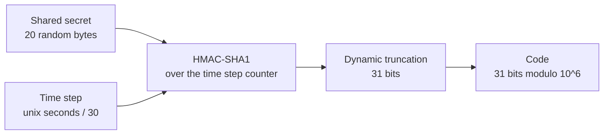
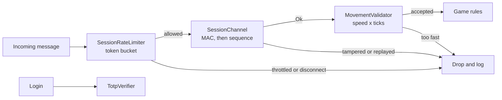

# Module 21: Security and anti-cheat

- **Goal:** understand what attackers do to an online RPG and why the server, not the client, is the real defence; then build the server-side pieces a small team can own: TOTP two-factor login, movement validation, rate limiting and replay protection.
- **Prerequisites:** [17 Networking](17-networking.md) (the message protocol), [18 State sync and interest management](18-state-sync.md) (what the client is allowed to know), [20 Persistence and transactions](20-persistence.md) (duping and the ledger).
- **Example:** `examples/21-security/` (`dotnet test examples/21-security`)
- **Facts checked:** October 2026 (prices, licences and product status change; re-check before reuse)

## In short

Anything that runs on the player's machine can be modified, so a client can never be trusted; it can only be **asked**. Online game security is therefore mostly **server authority**: the server decides what is possible and checks every request against its own state and clock. Around that core sit transport security (TLS), authenticated sessions, a second login factor, rate limits and logging. Client anti-cheat slows down casual cheaters and is useful, but it is an arms race that only a specialist vendor can run. The main design choices are how much authority the server keeps (and what that costs in responsiveness) and whether and when to buy a client anti-cheat. The example builds the parts a small team should own: a TOTP generator and verifier that matches the RFC 6238 test vectors, a movement validator that rejects speed hacks and teleports, a token-bucket rate limiter, and a message channel that rejects tampering and replays.

## 1. The concept

### 1.1 The threat model

A **threat model** lists who attacks what, and how. For an online RPG the common ones are:

| Attack | What the attacker does | What it breaks |
|---|---|---|
| **Speed and teleport hack** | Edits the client to move faster or to jump | Fair play, PvP, farming rates |
| **Packet tampering** | Changes a message in flight or crafts one by hand ("sell 9 potions") | Any rule the server forgot to check |
| **Replay** | Records a valid message (a purchase, a reward claim) and sends it again | The economy |
| **Bots and macros** | Automates play with scripts or by reading the screen or memory | Economy, rankings, other players' experience |
| **Duping** | Exploits a race or a failed step to copy an item or currency | The whole economy (see module 20) |
| **Account theft** | Phishing, password reuse, malware, session theft | The player's trust; support costs |
| **Information leaks** | Reads hidden state the client received (a map hack) | Stealth, ambushes, fairness |

The model also tells you what you do **not** defend against. A single-player cheat that harms no one else is a different problem from a cheat that affects the economy.

### 1.2 Server authority is the main defence

The rule is short: **the client sends intentions; the server decides outcomes.** "I want to move to X" and "I want to use skill 3 on that monster" are requests. The server checks the rules (distance, cooldown, cost, line of sight, ownership), computes the result and tells everyone. A modified client can then send any request it likes but cannot make an impossible one succeed.

Consequences you design for:

- **Never send what the client must not know.** Module 18's interest management also serves security: do not send hidden entities.
- **Never accept a result from the client.** Not damage, not drops, not "I picked up the item", not the client's own speed value.
- **Every request is validated against the server's state** (module 20 for the ledger, module 03 for server time).

### 1.3 Input validation

Treat every field of every message as hostile: the type, range, length and sequence. A request has to be valid on its own (a sensible id, a quantity from 1 to 99) and valid against state (the player owns the item, is near the NPC, has the gold). Failed validation is not just an error to return: it is a signal to **count and log** (section 1.9).

### 1.4 Speed and teleport checks

The server knows the character's speed (from class, buffs and mount) and knows how many ticks have passed. A claimed position can therefore be tested: the distance from the last accepted position must not exceed `speed × elapsed ticks`, plus a small tolerance for jitter. Two details matter: measure from the **last accepted** position (otherwise a teleport can be split into legal-looking steps), and take the speed from the **server**, never from the client.

In click-to-move games the server can compute the path itself and the client only walks it, so the check is even stronger: the client barely sends positions at all.

### 1.5 Rate limits

A cheat does not have to be clever to hurt you: a loop that sends 10,000 requests a second is a denial of service, a brute-force login or a dupe attempt. A **token bucket** gives each session a burst allowance (say 5 messages) that refills slowly (say one every 10 ticks). Messages over budget are dropped, and a session that keeps hammering is disconnected. Honest play stays well inside the budget.

### 1.6 Transport security: TLS

**TLS** (Transport Layer Security, the protocol behind HTTPS and `wss://`) gives three things between client and server: **confidentiality** (nobody on the path can read the traffic), **integrity** (nobody can change it unnoticed) and **server authentication** (the client talks to the real server). It is built into the platform; you configure a certificate and use `wss://`. It protects against network attackers, not against the player, who can still modify their own client before the data is encrypted.

Do not invent your own cipher. A home-made scheme, or a standard cipher wrapped in secret key-juggling, adds nothing that TLS does not do better and is eventually reverse-engineered.

### 1.7 Sessions and tokens

After login the server issues a **session token**: a long random value (at least 128 bits from the platform's secure random generator), kept server-side with an expiry, tied to the account and revoked on logout. Store only a hash of it in the database. Do not put the account password or any secret in later messages. Reconnecting uses the token, not the password. On top of TLS, a per-message authentication code with a sequence number (section 5) stops an attacker who gets between the layers or who replays recorded traffic.

### 1.8 Two-factor login with TOTP

A password alone is stolen too easily. **TOTP** (time-based one-time password, RFC 6238) adds a second factor: the server and the player's authenticator app share a secret; both compute a short code from the secret and the current 30-second time step; the player types it in.



Servers accept the previous and next time step too (clock drift), refuse to accept a time step twice (a phished code is single-use) and lock out repeated failures. A **matrix card** (a printed grid of numbers asked by coordinates) is an older second factor of the same family; it is weaker than TOTP because the grid is static and can be copied.

### 1.9 Client anti-cheat and its limits

A **client anti-cheat** is software running on the player's machine that looks for cheat tools, tampered game files and suspicious behaviour. Modern ones run at the operating-system kernel level. They are useful because they raise the cost of cheating and catch tools that read memory (map hacks, bots). They have hard limits:

- The defender runs on the attacker's machine; the arms race never ends.
- Detection signatures must be updated continuously, as cheat authors adapt.
- It does not protect anything the server doesn't also check.
- Kernel-level software raises privacy, compatibility and support concerns.

It is a layer of defence, not the foundation.

### 1.10 Logging and detection

Security without records is guesswork. Log security-relevant events (failed validation, throttling, logins from new places, large currency movements) with the account and the reason. Counters that grow past a threshold become alerts (`Violations` in the example). A human or a script then decides: warn, kick, suspend. Keep the audit trail from module 20 so that when an exploit is found you can find every account that used it and reverse the damage.

## 2. The design space

### 2.1 How much authority the server keeps

| Model | How it works | Typical fit | Cost |
|---|---|---|---|
| **Fully server-authoritative** | The client sends intentions; the server computes every outcome, including movement | MMORPGs with click-to-move or tab-target combat, economy-heavy games | Latency must be hidden with prediction; more server CPU |
| **Server-validated client movement** | The client moves itself and reports positions; the server checks speed, collision and teleports | Action RPGs and shooters where input must feel instant | Needs good tolerances; false positives annoy honest players |
| **Client-trusted with spot checks** | The client reports results; the server samples or audits | Casual, cooperative or single-player-with-leaderboard games | Cheating is easy; fine only when nothing shared is at stake |
| **Peer-to-peer or listen server** | One player's machine is the authority | Small co-op games | The host can cheat; no persistent economy |

The same choice appears per feature: even in an action game, **drops, currency, inventory and quest progress** should always be server-authoritative, while hit detection may be validated rather than computed.

### 2.2 Single character, party or squad

- **One character per player:** movement and skill validation concerns one entity, and the speed comes from that character's stats.
- **A party of several characters controlled by one player:** every controlled character needs its own validation state, and commands to the non-leading characters are still requests that the server checks. Do not let "the AI is running it" excuse missing checks.

### 2.3 Client anti-cheat

| Option | Fit | Cost |
|---|---|---|
| **None, server rules only** | Prototypes, small or co-op games, early launch | Bots and memory readers go undetected by design |
| **Vendor anti-cheat** | Competitive or economy-heavy live games | Licence fee (as of October 2026, ask vendors), compatibility and privacy concerns |
| **In-house client protection** | Rarely justified | Needs a specialist team and constant updates |

**When a vendor anti-cheat is worth buying:**
- Ranked or competitive play where one cheater ruins many matches.
- A player economy where bots drain value (farming bots, gold sellers) and server-side detection no longer keeps up.
- A platform or store that expects it.
- You can afford the licence and the support load (compatibility, privacy questions, false-positive appeals).

If none of these applies yet, wait: add it after launch, when real cheating data shows what to defend.

### 2.4 How to choose

| If your game... | Prefer |
|---|---|
| Has a persistent economy or trading | Full server authority for items and currency, plus audit logs, from day one |
| Is real-time and needs instant input feel | Server-validated client movement with a documented tolerance |
| Is competitive (ranked PvP) | The above plus a vendor client anti-cheat, once players or a store require it |
| Is a small co-op or single-player game | Minimal checks; spend effort on account security instead |
| Offers paid accounts or valuable items | Two-factor login and session protection |

## 3. Trade-offs and pitfalls

- **Obscurity is not security.** A custom cipher with a key table baked into every client is a speed bump; anyone who controls the client can read the key. Use TLS and a message authentication code.
- **No replay protection.** Without a sequence number inside an authenticated envelope, any rule that accepts a message "as if new" is open to re-sending a recorded one.
- **Tolerance tuning.** Too strict and honest players are rubber-banded by lag; too loose and speed hacks hide inside the slack. Measure from the last accepted position and take speed from the server.
- **False positives cost more than missed cheaters.** Wrongly banning a paying player is worse than letting a small cheat live for a day. Log first, act by thresholds, keep an appeals path.
- **Anti-cheat as the only defence.** If its protection lapses, nothing server-side compensates for memory-reading bots.
- **Weak second factors.** A static grid card can be copied; time-based codes cannot be reused.
- **Bots and macros remain.** An authoritative server cannot tell a person from a script that sends legal requests; detection needs behavioural statistics and human review.

## 4. Build or buy

**What engines give you.** Unreal, Unity and Godot provide the transport and, in some cases, helpers: Unreal and Unity netcode can run dedicated authoritative servers; Unity and Godot support `wss://` and platform TLS. None of them defends your game rules; server authority is a design you implement. Epic offers Easy Anti-Cheat for Unreal and other engines, and similar products exist (as of October 2026).

| Piece | Verdict | Why |
|---|---|---|
| **Server authority and validation** | Build | It is your game's rules; nobody else can write them |
| **TLS** | Use the platform | ASP.NET (Kestrel) supports it directly; use certificates from a public authority; never roll your own cipher |
| **Session tokens** | Build (small) or use a standard library | Random bytes, a hashed store, an expiry |
| **TOTP two-factor** | Build | RFC 6238 is a small public standard; .NET provides HMAC; any authenticator app is the client |
| **Rate limiting** | Build, or use ASP.NET Core's built-in rate-limiting middleware for HTTP | Token buckets are a few dozen lines; game messages need per-session, per-action limits |
| **Replay protection and message authentication** | Build (small) | HMAC plus a sequence number |
| **Logging and detection** | Build on your logging stack | Counters and thresholds; the audit log from module 20 |
| **Client anti-cheat** | **Buy** | See below |

**Could we build the anti-cheat ourselves?** Not in a way that is worth the money. It needs kernel-level expertise on several operating systems, a continuous research team that tracks new cheat tools, signing and compatibility work, and a response to every new bypass. Vendors such as Easy Anti-Cheat and similar products (as of October 2026) amortise this over many games. A small team's best use of its time is to make the server so strict that a cheating client has little to gain, and to add a vendor anti-cheat only if bots and memory tools become a real problem, typically after launch.

**What a proof of concept must prove.** (1) A modified test client that speeds up, teleports, replays and floods gets rejected, logged and throttled, while a normal bot client at full speed is never rejected (false positives matter more than detection). (2) The TOTP flow works with a real authenticator app and survives clock drift of one step. (3) Under load, validation and rate limiting add a negligible share of the tick budget. (4) Every rejection produces a log entry with enough detail to investigate.

**Verdict: build the server-side layers, use the platform for TLS, buy the client anti-cheat only if and when you need it.**

## 5. The example

### 5.1 Design



The order is deliberate: cheapest checks first, authentication before anything depends on the message contents, game-rule validation last.

### 5.2 Walkthrough

- **`Totp.cs`**: RFC 6238 on top of RFC 4226. It encodes the time step as an 8-byte big-endian counter, computes `HMAC-SHA1` with the shared secret, applies dynamic truncation (the low four bits of the last byte pick an offset; four bytes from there, with the top bit cleared, form a 31-bit number) and takes it modulo 10 to the number of digits.
- **`TotpVerifier.cs`**: accepts the current time step plus or minus one, compares in constant time, refuses a time step that is not newer than the last accepted one, and locks out after five consecutive failures.
- **`MovementValidator.cs`**: remembers the last accepted position and tick per entity. `Check` allows `maxSpeed × max(1, elapsed ticks) × (1 + tolerance)`, returns the authoritative position (the claim if accepted, the old position if not) and counts violations.
- **`SessionRateLimiter.cs`**: a token bucket per session, with strikes toward a disconnect.
- **`SessionChannel.cs`**: seals a payload with a sequence number and an HMAC-SHA256 tag over both. `Open` verifies the tag first, then requires a strictly increasing sequence number.
- **`Point2.cs`, `MoveResult.cs`, `SealedMessage.cs` and the small enums**: plain data.

The heart of the movement check:

```csharp
var elapsed = Math.Max(1, tick - t.Tick);
var allowed = maxSpeedPerTick * elapsed * (1 + _tolerance);
if (t.Position.DistanceTo(claimed) > allowed) return rejected;   // snap back, count a violation
```

and of the replay check:

```csharp
if (!FixedTimeEquals(Tag(message.Seq, message.Payload), message.Tag)) return OpenResult.Tampered;
if (message.Seq <= _lastReceivedSeq) return OpenResult.Replayed;
```

### 5.3 Tests and their concrete numbers

32 tests, all passing (`dotnet test examples/21-security`):

- **RFC 6238 test vectors** (`Generate_Rfc6238Sha1Vectors_MatchExactly`): with the secret "12345678901234567890" and 8 digits, times 59, 1111111109, 1111111111, 1234567890, 2000000000 and 20000000000 produce 94287082, 07081804, 14050471, 89005924, 69279037 and 65353130. The six-digit code at time 59 is 287082.
- **TOTP rules**: a correct code is valid; the same code again is `AlreadyUsed`; a code one step old is accepted but two steps old is not; five wrong codes lock the account, even against the right code; a success resets the count.
- **Speed hack** (`Check_DoubleSpeedHack_RejectedAndSnappedBack`): speed 2 units per tick, 10 ticks, tolerance 10 percent gives an allowance of 22. Walking 20 units is accepted. Claiming 40 is rejected and the position stays at (0, 0).
- **Teleport**: (1000, 1000) in one tick is rejected. A teleport split into 10-unit steps every tick is rejected every time.
- **Small sustained hack**: 30 percent too fast (2.6 units per tick against an allowance of 2.2) is rejected on all 50 ticks, and the validator counts 50 violations.
- **Lag burst**: nothing for four ticks and then a burst covering 8 more units is accepted, because elapsed time counts.
- **Rate limit**: capacity 5 and a refill of 0.1 per tick; 100 messages on the same tick give 5 allowed and 95 throttled. After 30 quiet ticks, exactly 3 more pass. A steady one message per 10 ticks is never throttled. A sustained flood is disconnected on the 20th consecutive refusal.
- **Replay and tamper**: a message re-sent after acceptance is `Replayed`; an older message after a newer one is `Replayed`; an edited payload or sequence number is `Tampered`; a message sealed under another key is `Tampered`. A forged message does not advance the sequence, so the genuine message 1 is still accepted.

### 5.4 What the example leaves out

- **TLS, certificates and key exchange.** Platform features; configure them, don't write them. The channel here assumes both ends already share a session key.
- **Confidentiality.** `SessionChannel` gives integrity and freshness, not secrecy.
- **Session token storage and expiry**, and Base32 for the secret an authenticator app scans (usually shown as a QR code).
- **Obstacles in the movement check.** Real servers also test walls, terrain height and path validity (module 07).
- **Out-of-order delivery.** Over TCP or WebSocket, messages arrive in order, so a strict sequence works. A UDP transport would use a sliding window of recently seen numbers.
- **Behavioural bot detection**, for example statistics on timing and routes. It builds on the same logs but is a separate subject.

## Key takeaways

- A client can never be trusted; it sends intentions and the server decides outcomes. Server authority is the foundation, and everything else is a layer on top.
- Choose the authority model per feature: always server-owned for economy and progression, validated for movement when input feel matters.
- Validate every message against the server's own state and clock, and count and log what fails.
- Use TLS from the platform instead of a home-made cipher. Add an authentication code and a strictly increasing sequence number to stop tampering and replays.
- TOTP is a small public standard (RFC 6238): a few dozen lines, matched by test vectors, and any authenticator app is the client. Make codes single-use and lock out guessing.
- Check movement as `distance <= speed x elapsed ticks x tolerance` from the last accepted position, with the speed taken from server data.
- Build the server-side layers; buy client anti-cheat only if bots or memory tools become a real problem.

## Further reading
- RFC 6238, [TOTP: Time-Based One-Time Password Algorithm](https://www.rfc-editor.org/rfc/rfc6238), and RFC 4226, [HOTP](https://www.rfc-editor.org/rfc/rfc4226).
- OWASP, [Cheat Sheet Series](https://cheatsheetseries.owasp.org/) (authentication, session management, transport layer security).
- Valve, ["Source Multiplayer Networking"](https://developer.valvesoftware.com/wiki/Source_Multiplayer_Networking) (server authority and lag compensation).
- Gabriel Gambetta, ["Fast-Paced Multiplayer"](https://www.gabrielgambetta.com/client-server-game-architecture.html) (why the server must be authoritative).
- Microsoft, [Rate limiting middleware in ASP.NET Core](https://learn.microsoft.com/en-us/aspnet/core/performance/rate-limit) and [Kestrel HTTPS configuration](https://learn.microsoft.com/en-us/aspnet/core/fundamentals/servers/kestrel/endpoints).
- Epic Games, [Easy Anti-Cheat](https://dev.epicgames.com/docs/game-services/anti-cheat) (as an example of a licensed client anti-cheat).
