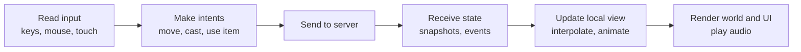

# Module 22: The client's job

- **Goal:** understand what a game client does (and must never do), why an online RPG can get away with a thin client, which technology choices exist, and where an engine earns its keep.
- **Prerequisites:** [03 - The game loop and time](03-game-loop.md), [17 - Networking: protocol and client-server interaction](17-networking.md), [18 - State sync and interest management](18-state-sync.md)
- **Example:** none of its own. Section 5 walks through the thin client in `examples/17-net/` (the HTML page and the C# bot).
- **Facts checked:** October 2026 (prices, licences and product status change; re-check before reuse)

## In short

The client is the part of the game that the player touches. It turns keyboard, mouse and touch into **intents**, turns server **state** into pictures and sound, and hides latency with interpolation or prediction. It is also the part the player controls, so it holds **no authority**: anything that matters (positions, damage, drops, prices) is decided on the server. How much the client does on its own is the main design choice: wait for the server's echo, interpolate, or predict and reconcile. The client is where a commercial engine pays off most. The course's thin browser page shows the minimum a client needs.

## 1. The concept

### 1.1 What a client does, in one loop

A client is a loop too, but a different one from the server's. The server steps a simulation at a fixed rate. The client runs once per **display frame** (often 60 times a second) and does six jobs.

| Job | What it means |
|---|---|
| **Input** | Collect raw events, translate them through a key map and the current UI focus into game actions. |
| **Intents** | Turn actions into protocol messages ("move to", "cast skill 3 on target 17"). Never into results. |
| **State mirror** | Keep a local copy of what the server has told you is visible. It is a cache, not the truth. |
| **Interpolation** | Draw smooth motion from sparse updates (below). |
| **Rendering and UI** | Draw the world, then the interface on top. |
| **Audio and assets** | Play sounds; load models, textures and sounds on demand without freezing the frame. |

### 1.2 Interpolation, prediction, and doing neither

Server updates arrive a few times a second; the screen redraws sixty times. The gap is filled in one of three ways. They form a ladder of cost and feel.

| Approach | What the client does | Feel | Cost |
|---|---|---|---|
| **Wait for the echo** | Nothing happens until the server answers. | Slight delay after every click | Almost none |
| **Interpolate** | Moves remote things smoothly between received states (often drawing slightly in the past). | Smooth, but input still has latency | Small |
| **Predict and reconcile** | Applies your own input immediately, then corrects when the server disagrees. | Instant response | Large: the client must run a copy of the rules and rewind on mismatch |

Fast action games need prediction. A click-to-move RPG, where a skill has a wind-up of half a second anyway, often does not. A cheap variant of interpolation sends **start, target, speed and timestamp** once, and lets the client compute every in-between position itself (this is called **dead reckoning**; see [17 - Networking](17-networking.md)).

### 1.3 Thin and thick clients

A **thin client** shows and asks; a **thick client** also computes. The line is drawn by one question: *what happens if the player edits this code?*

| Lives on the client | Lives on the server |
|---|---|
| Rendering, animation, camera, UI layout | Positions, collisions, line of sight that matters |
| Input mapping, hotkeys, cursor modes | Hit, damage, cooldown, cost checks |
| Sound, particles, screen shake | Drops, prices, inventory, quest state |
| Interpolation, local-only previews ("you can't afford this") | Anything another player can observe or that costs something |

Local checks are a courtesy that saves a round trip; the server repeats them as the real check. A client may *grey out* a button for a skill on cooldown, but the server must still refuse the cast.

### 1.4 What must never live on the client

- **Authority over results:** damage rolls, drop rolls, success chances. A client that rolls its own dice is a cheat tool waiting to happen.
- **Secrets:** hidden stats of other players, unspawned monsters, other zones' data. Whatever reaches the client can be read; send only what the player may know (see [18 - State sync](18-state-sync.md)).
- **Trust in its own clock or position.** Treat every number from the client as a request.
- **Keys and credentials** of any backend service.

## 2. The design space

### 2.1 Control and camera

| Style | How the player acts | Client needs | Typical games |
|---|---|---|---|
| **Click-to-move, tab-target** | Click ground or enemy; skills are hotkeys | Picking, path preview, target frame | Classic MMORPGs, isometric RPGs |
| **Direct control, action combat** | WASD or stick moves continuously; skills aim by cursor | Prediction, hit feedback, tight input handling | Action RPGs, MMO action combat |
| **Virtual joystick and buttons** | Touch controls | Large hit targets, auto-targeting help | Mobile RPGs |
| **Auto-play or idle** | Player sets behaviour; the game plays | Minimal input, rich status UI | Mobile idle and gacha RPGs |

### 2.2 One character or a party

With a **single character**, the HUD shows one set of bars, skills and cooldowns. A **party** of several controlled characters needs a way to pick or switch who is driven, separate skill bars and hotkeys per member, and a compact status view for the rest. Common approaches are a party panel with click-to-select, number keys to switch leader, or per-character hotkey blocks that fire a member's skill without switching. Decide this early: it shapes the input map and the whole HUD.

### 2.3 Client technology

| Choice | Fits | Notes (as of October 2026) |
|---|---|---|
| **Engine client** (Unreal, Unity, Godot) | 3D worlds, effects, controllers, consoles and mobile | Brings renderer, animation, audio, asset pipeline, editor, UI toolkit |
| **Web client** (HTML, TypeScript, canvas or WebGL/WebGPU, React-style UI) | 2D or light 3D, instant start, no install | Small download, easy updates; weaker for heavy 3D, memory and audio limits |
| **Custom engine** | Studios with a strong reason | Full control, very high cost |

### 2.4 UI architecture

| Approach | Idea | Fits |
|---|---|---|
| **Immediate mode** | Redraw every widget each frame from current state | Debug tools, small UIs |
| **Retained mode** | Widgets are objects that persist and receive events | Large game interfaces with many windows |
| **DOM and CSS** (web) | The browser is the toolkit | Inventories, chat, menus, anything list-like |

Whatever the approach, bind windows to a **state store** that the network layer updates, not to the live world. A window should be rebuildable without touching rendering.

### 2.5 How to choose

| If you want... | Choose |
|---|---|
| Great 3D visuals on PC, console and mobile | An engine client |
| A small team, 2D or isometric, fast iteration | A web client with DOM UI |
| Tight twitch combat | Prediction, from day one |
| Click-to-move with wind-up skills | Wait-for-echo plus interpolation |
| Thick-client convenience (offline play) | Keep the rules in a shared library, still validate on the server |

## 3. Trade-offs and pitfalls

- **Visible latency.** Waiting for the echo makes every click wait a round trip. Fine on good connections, sluggish on poor ones.
- **Prediction is expensive.** The client needs a copy of the rules, and every rules change must ship to both sides in lockstep.
- **Big UIs are mostly state handling.** Each new window is another class tied to the session store; budget for it.
- **Unconditional work every frame.** A flat loop that does everything each frame burns CPU on idle screens and races with asset loading. Add idle sleeping and background loading early.
- **Trusting the client.** Speed hacks, bots and packet edits attack timing and volume; check rates and ranges on the server.
- **Engine lock-in.** A client written inside an engine ties you to its upgrades and licences. Keeping rules on the server keeps the decision reversible.

## 4. Build or buy

### 4.1 What engines give you

| Piece | Unreal | Unity | Godot |
|---|---|---|---|
| Renderer, lighting, effects | Best-in-class 3D | Strong, many pipelines | Good, improving 3D |
| Animation and skeletons | Full toolchain | Full toolchain | Capable |
| Audio mixing | Built in | Built in | Built in |
| UI | Widget editor, data binding | UI Toolkit and uGUI | Control nodes and themes |
| Asset import and packaging | Strong | Strong | Good |
| Editor, profiler, hot reload | Yes | Yes | Yes |
| Platforms | PC, console, mobile | Widest reach incl. web | PC, mobile, web (3D limited) |
| Language | C++ and visual scripting | C# | GDScript and C# |

Licences and fees change; as of October 2026 check each vendor's current terms before committing.

### 4.2 Could we build it ourselves?

| Piece | Build in-house? | Effort and risk |
|---|---|---|
| A 2D or light 3D renderer on WebGL/WebGPU | Feasible with an open rendering library | Weeks for a PoC; art pipeline is the long pole |
| Scene graph, particles | Feasible, but a lot of unglamorous work | Months to match what an engine ships |
| UI | Use the browser (DOM and CSS) and a component library | Cheapest by far; this is where the web wins |
| Skeletal animation, skinning, blending | Possible with open formats, hard to polish | High risk; art tooling matters more than code |
| Audio | Browser audio or an open library | Low risk |
| Asset streaming and caching | Build it | A few weeks; the web gives HTTP caching for free |
| Platform ports, console certification | Do not build | Engine territory |

What a PoC must prove: a character walks smoothly from server updates with 200 visible entities at a steady frame rate on a mid-range laptop and a mid-range phone; assets stream in without frame hitches; and one full UI flow (inventory, with drag and drop) works.

### 4.3 Verdict

**Buy the engine for a 3D client; build the UI and network layer yourself in either case.** A small team cannot reasonably rebuild a renderer, animation and audio stack, and AI-assisted development does not change the art-pipeline cost. For a **light 2D or isometric client**, a **web stack** (TypeScript, a 2D rendering library, DOM UI) is cheaper than any engine and gets instant updates. Either way the client's network and state-mirror code is thin and should be written to the protocol of [module 17](17-networking.md). The thin-client rule keeps this decision reversible: if the server owns the rules, changing the client technology later does not touch the game.

## 5. The example

This module has no project of its own, because the thinnest useful client already exists in module 17. Read it as a reference for **what the client's job looks like when nothing is hidden**.

### 5.1 The HTML client

The page in `examples/17-net/wwwroot/` is about 80 lines of plain JavaScript. Map its parts to the six jobs of section 1.1.

| Job | In the page |
|---|---|
| Input | A click handler on the map element; a text box and button for chat |
| Intents | `send('move', {x, y})` after converting pixels to world units; the world is 0 to 100, the map is 400 pixels |
| Network | One `WebSocket`, a `hello` with the protocol version on open, JSON envelopes `{op, seq, payload}` |
| State mirror | A `Map` of players, replaced on a `state` message with `full: true`, merged otherwise |
| Rendering | Delete and rebuild one `div` dot per player; the local player is red |
| Log | Every message in and out is printed, so the protocol is visible |

Three things are deliberately absent, and each marks where a fuller client grows.

- **No interpolation.** Dots jump to the new position when a `state` arrives. A fuller client keeps the previous and next snapshot and draws a point between them, usually 100 ms behind real time.
- **No prediction.** The click sends a request; the dot moves only when the server's state says so. This is the lowest rung of the ladder in section 1.2.
- **No authority.** The page never decides a position. Typing a different coordinate in the browser console only sends a different request, which the server validates (the rate limiter and range checks of module 17).

### 5.2 The bot client

The C# `BotClient` is a client with no screen. It connects, sends `hello`, and exposes `WaitForAsync` to read the next message matching a predicate. It shows the same duties in headless form:

- a **receive loop** that turns frames into envelopes and puts them on a channel;
- a **sequence counter** so replies can be matched to requests;
- a **handshake** that stores the session id and player id from `welcome`.

Because it uses only the protocol, tests can drive a real server with it, and the same class works as a small load generator. Any client in any technology is just another speaker of the same protocol.

### 5.3 What a fuller client would add

| Addition | What it needs |
|---|---|
| Interpolation | Timestamped snapshots; a render time slightly behind server time; a ring buffer per entity |
| Real rendering | A 2D library or an engine; sprites, animation states, camera |
| Click picking | Convert screen point to world point; on a 3D map, a ray cast and a walkable-ground check |
| Targeting mode | A small state machine: idle, skill armed, waiting for the click, then the intent |
| UI | Windows bound to a state store that the network layer updates; not to the world |
| Hotkeys | A data table of key to action, rebindable and saved |
| Asset loader | Manifest, prioritised downloads, cache, placeholder while loading |
| Audio | Event-driven sounds with distance falloff |
| Reconnect | Use the session id; request a full state after reconnecting |
| Optional prediction | Only for the local player's movement, and only if the latency is measured to hurt; needs a shared rules library and reconciliation |

## Key takeaways

- The client loops over input, intents, state mirror, interpolation, rendering and audio. It sends requests and shows results.
- Authority stays on the server. The client may check things as a courtesy, never as the rule.
- Wait-for-echo, interpolate, predict: pick the lowest rung the genre tolerates.
- A party game needs per-character hotkeys and a compact status view; decide this before you design the HUD.
- Bind windows to a state store, not to the world, so UI can change without touching rendering.
- Buy the engine for a 3D client; use the browser as the UI toolkit for a light client; always build the protocol and state-mirror code yourself.
- The thin client in module 17 already shows the full duty list, minus smoothness and graphics.

## Further reading

- [Gabriel Gambetta, Fast-Paced Multiplayer](https://www.gabrielgambetta.com/client-server-game-architecture.html): client-side prediction, interpolation and reconciliation, step by step.
- [Glenn Fiedler, Fix Your Timestep!](https://gafferongames.com/post/fix_your_timestep/) and the Gaffer on Games networking series.
- [Valve, Source Multiplayer Networking](https://developer.valvesoftware.com/wiki/Source_Multiplayer_Networking): entity interpolation and lag compensation.
- [MDN Web Docs: WebSocket API](https://developer.mozilla.org/en-US/docs/Web/API/WebSockets_API), [Canvas API](https://developer.mozilla.org/en-US/docs/Web/API/Canvas_API) and [WebGPU API](https://developer.mozilla.org/en-US/docs/Web/API/WebGPU_API).
- Unreal, Unity and Godot documentation for their UI systems and asset pipelines.
