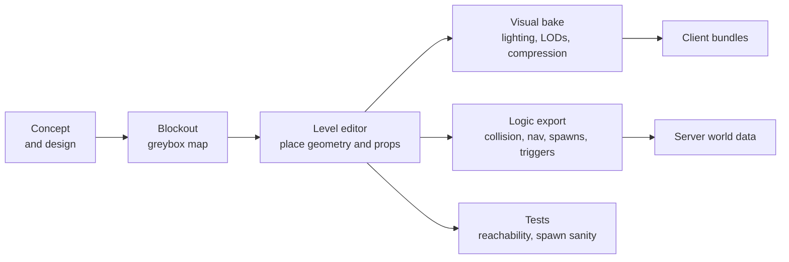
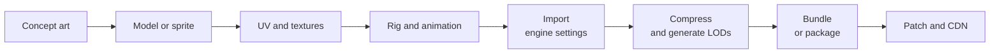

# Module 23: World and content production: maps, tools and asset pipelines

- **Goal:** understand how the maps, characters and effects of an online game are produced, versioned and shipped, and how the server uses the world without ever loading its art.
- **Prerequisites:** [04 - Entities, world and zones](04-entities-world.md), [07 - Navigation and pathfinding](07-navigation.md), [24 - Content pipeline, localisation and testing](24-pipeline-testing.md)
- **Example:** none
- **Facts checked:** October 2026 (prices, licences and product status change; re-check before reuse)

## In short

A game world is made of two layers that should be authored together and shipped separately. The **visual layer** (meshes, sprites, textures, animation, lighting) is large and only the client needs it. The **logic layer** (walkable areas, collision, spawn points, triggers, region names) is small and the server needs it. A good pipeline keeps one source of truth for the world, **bakes** the visual and logic outputs from it, and names and versions everything so patches stay small. Teams choose between an engine's editor and in-house tools, and between hand-made, outsourced and AI-assisted assets. Each choice is mostly about cost, control and licensing.

## 1. The concept

### 1.1 Two layers of a world

| Layer | Contents | Who needs it | Typical size |
|---|---|---|---|
| **Visual** | Terrain or tile art, models, textures, animation, particles, lighting, audio | Client only | Gigabytes |
| **Logic** | Collision shapes, walkable area, spawn points, trigger volumes, zone and region ids, portals | Server (and client for prediction) | Kilobytes to a few megabytes |

The server is authoritative about where things can stand and what happens when they step somewhere. It does not render. So the logic layer must be **exportable on its own**, as plain data, from the same source the artist works on.

### 1.2 The production flow

A **blockout** (greybox) is a map of plain boxes used to check scale, routes and pacing before artists spend weeks on it. It is the cheapest place to fix a bad layout.

## 2. The design space

### 2.1 How maps are represented

| Representation | How it works | Best for |
|---|---|---|
| **Tile map** | A grid of tiles from a tile set; layers for ground, objects, collision | 2D games, top-down RPGs, mobile |
| **Heightmap terrain** | A grid of heights plus a paint layer for materials; props placed on top | Large outdoor 3D areas |
| **Modular 3D levels** | Hand-placed meshes and kits (walls, floors) assembled in an editor | Dungeons, towns, interiors |
| **Procedural or generated** | Rules or noise build the map; a seed makes it reproducible | Roguelikes, filler terrain, randomised instances |
| **Pre-rendered backgrounds** | A painted or rendered image with a hidden collision and navigation layer | Stylised or classic 2.5D looks |

Many games mix them: a heightmap for the outdoors, modular kits for buildings, tile data for the minimap.

### 2.2 Zone layout across game types

| Type | World structure |
|---|---|
| Classic MMORPG | **Zones** (separate maps) joined by portals, loaded one at a time |
| Seamless open world | One huge world streamed in cells around the player |
| Instanced RPG | Hubs plus private instances; most maps are small and hand-tuned |
| Mobile and 2D | Small tile-based maps with fast load times |

Zones keep server logic simple (one process per zone, module 19). Seamless worlds need cell streaming on the client and boundary handling on the server, and pay for it in complexity.

### 2.3 Editors: engine or in-house?

| Option | For | Against |
|---|---|---|
| **Engine editor** (Unreal, Unity, Godot) | Free or included; artists already know it; previews match the client | The server must read its data, so you need an exporter; editor format and version churn |
| **Standalone 2D tools** (Tiled, LDtk) | Free, focused, file formats are open (JSON or XML) and easy to read from a server | 2D only; no lighting or 3D preview |
| **DCC tools** (Blender, others) | Free (Blender) or paid; model, rig and sculpt | Not a level editor; export to the engine through standard formats |
| **In-house editor** | Exactly the data your server needs; one tool for spawns, quests and portals | A permanent maintenance cost; it needs a team |

A common compromise: art in the engine editor or a DCC tool, and a **small in-house tool or a plugin** only for the game-specific logic (spawn groups, triggers, region data).

### 2.4 How to choose

| If you have... | Choose |
|---|---|
| A 2D game and a small team | Tiled or LDtk; read the JSON on the server |
| A 3D game on Unity, Unreal or Godot | The engine's editor plus an exporter for server data |
| Heavy server-side logic on the map | A custom component in the editor that marks logic objects |
| A very large world | Streaming or partitioning from day one, not as a late port |

## 3. Trade-offs and pitfalls

- **Two sources of truth.** If artists place walls in the editor and designers separately draw collision for the server, the two drift apart and players walk through walls or stand on air. Export logic from the art scene.
- **Baked data goes stale.** A navigation mesh or collision file baked last month does not match this week's level. Rebuild it in the build, not by hand, and fail the build when a spawn point is unreachable.
- **Spawn data in a binary scene.** If monster placement lives inside an editor file, designers cannot review changes, diffs are unreadable and merge conflicts are painful. Keep spawns in text data that references the map by id.
- **Asset sprawl.** Without naming rules and an owner, the project fills with `rock_final_v3`. Naming and folders are a cheap discipline that pays back in patch tooling.
- **Patch size.** Rebuilding a bundle because of one changed texture forces players to download hundreds of megabytes. Group assets by how often they change, not only by what they are.
- **Memory and loading.** Textures are the largest runtime memory item; unbounded asset quality breaks low-end devices and loading times.
- **Tool lock-in.** A world stored only in an editor's proprietary format is hard to migrate when the editor version changes.

## 4. The art and asset pipeline

### 4.1 From idea to shipped asset

| Step | What happens | Common tools |
|---|---|---|
| Concept | Look and silhouette fixed before modelling | Drawing tools, mood boards |
| Model or sprite | 3D mesh (low-poly for games) or 2D sprite sheet | Blender, Maya, 3ds Max, Aseprite |
| Texturing | Surface painted or generated (base colour, normal, roughness) | Substance, Photoshop, Krita |
| Rig and animation | A skeleton (**rig**) and clips: idle, walk, attack | Blender, Maya, motion capture, animation libraries |
| Import | Engine converts the source to its internal format with settings | Engine importers (FBX, glTF, PNG) |
| Compression | Textures to GPU formats, meshes to smaller layouts, audio to lossy codecs | Engine and platform toolchains |
| LOD and variants | Lower-detail versions for distance; quality tiers for platforms | Engine tools |
| Bundle | Group into downloadable packages | Unity Addressables or AssetBundles, Unreal's pak and IoStore with chunking, Godot PCK files |

glTF is an open, widely supported format for 3D models and is a good interchange format between tools.

### 4.2 Naming, versioning and storage

- **Naming:** a prefix for the type (`char_`, `env_`, `fx_`), a stable id and a variant; no spaces; lowercase. The id is what data refers to, never the file path.
- **Source vs shipped:** keep the source (layered files, scenes) separate from the exported asset. Only the exported form is bundled.
- **Large files:** code fits in Git; art does not. Use Git LFS, Perforce or a similar system built for large binaries. Perforce is common in studios, Git with LFS is common in small teams. Check the current storage prices.
- **Asset ids:** use stable ids that survive renames, so a renamed asset does not break saved data and spawn tables.
- **Version stamps:** every bundle records a content hash so the client knows what to download.

### 4.3 Streaming and patch size

| Technique | What it does |
|---|---|
| **Cell streaming** | Loads world cells near the player; unloads distant ones (Unreal World Partition, Godot scene loading, Unity scene streaming or Addressables) |
| **Chunked bundles** | Groups assets so a patch changes a few small bundles |
| **Delta patching** | Sends only the changed bytes of a file |
| **On-demand download** | Ships a small base and fetches zones when first visited |
| **Compression** | Texture formats (BC7 on desktop, ASTC on mobile), mesh and audio compression |

Mobile and browser platforms care most: store limits and download costs force streaming and on-demand content.

## 5. Navigation, spawns and triggers: what the server consumes

The server wants a handful of small files per zone.

| Data | Purpose | Produced by |
|---|---|---|
| **Collision** | Blocking shapes (2D polygons, a grid or simple 3D volumes) | Exported from the level, simplified from art meshes |
| **Navigation data** | A grid, waypoint graph or **navmesh** for pathfinding (module 07) | **Baked** from collision in the build |
| **Spawn data** | Where monsters, NPCs and gatherables appear, how many and how fast they respawn | Designer-edited text or table, referencing map ids |
| **Triggers** | Volumes that fire events: enter a region, start a quest, open a door | Marked in the level, exported with ids |
| **Zone metadata** | Name, level range, safe or PvP, music, portal targets | A data table |

### 5.1 Baking

**Baking** turns authoring data into a fast runtime form: from visible geometry to a navmesh, from many triangles to a few collision boxes, from layout to a spatial grid. Baking should be a **build step**, deterministic and run in continuous integration. Unreal bakes navigation meshes and supports world-partitioned navigation for large worlds; Godot has `NavigationRegion` baking, in the editor and at runtime; Unity offers a navigation package. A server written in C# can read the baked data directly, or you can export your own simplified form.

### 5.2 Spawn and NPC placement

Treat placement as **data**. A row says: monster type, position or region, count, respawn seconds, level. Benefits: designers edit without a code change, diffs are reviewable, and tests check every spawn point lies on walkable ground. Dynamic mobs, events and rare spawns are just more rows with rules.

### 5.3 Validation in the build

Cheap automated checks catch most world bugs:

- every spawn lies on walkable ground;
- every portal's target exists and has a return;
- every region id used in quests exists;
- the navigation graph connects spawn points to the main route;
- no asset id is referenced that is missing from the bundles.

## 6. Where assets come from

### 6.1 Sourcing options

| Source | Strengths | Weaknesses |
|---|---|---|
| **In-house artists** | Style control; fast iteration | Salaries; hard to scale up quickly |
| **Outsourcing studios** | Elastic capacity, specialised skills | Brief quality decides output quality; review overhead; time zone friction |
| **Asset stores** (Unreal Fab, Unity Asset Store, others) | Cheap, fast prototypes | Recognisable assets; licence limits; uneven quality |
| **Open-licensed assets** | Free | Check each licence (attribution, no-commercial clauses) |
| **AI-assisted** | Very fast concepts, textures and variations | See below |

Outsourcing works best with a **style guide**, a fixed budget per asset, clear acceptance tests (poly count, texture size, naming) and staged delivery: concept, blockout, final.

### 6.2 AI-assisted asset creation (as of October 2026)

- **Good fits:** concept art and mood boards, texture variations, tileable materials, rough 3D blockout meshes, voice and sound drafts, localisation drafts, and code for tools and validators.
- **Current limits:** generated 3D meshes often need clean-up (topology, UVs, scale), animation rigs are usually still made or retargeted by people, and style consistency across hundreds of assets needs a controlled workflow and human art direction.
- **Licensing and policy caveats:** copyright protection for output with little human authorship varies by country and is still being tested in courts and offices (in the US, the Copyright Office's guidance says purely machine-generated material is not protected, while human-directed selection and arrangement can be). Model licence terms differ in what you may do with outputs. Some platforms ask developers to disclose AI-generated content (Steam has a disclosure requirement), and some asset stores restrict AI-generated listings. Read the terms of every tool, keep records of prompts and edits, and have a lawyer look at anything you ship commercially.
- **Practical rule:** use AI to speed up the early steps (concept, blockout, variation), keep humans in control of final look and in the rigging and integration steps, and keep a manual process as a fallback.

## 7. Build or buy

| Need | Unreal | Unity | Godot | Other tools |
|---|---|---|---|---|
| Level editor | Full 3D editor; World Partition for large worlds (as of October 2026) | Scene editor; terrain and ProBuilder style tools | Scene editor for 2D and 3D | **Tiled** and **LDtk** for 2D maps |
| Navigation baking | Built-in navigation mesh | Navigation package | Navigation server and regions | Recast and Detour (open source) |
| Asset import and bundles | Pak and chunking | Addressables | PCK files | Your own build scripts |
| DCC | Not included | Not included | Not included | **Blender** (free and open source) |
| Large file versioning | Perforce integration | Git LFS or Perforce | Git (assets are text-friendly) | Git LFS, Perforce |

**Could we build it today?**

| Piece | Effort | Risk |
|---|---|---|
| Exporter from the editor to server data (collision, spawns, triggers) | Low to medium | Low if the format is plain JSON; it is the most valuable tool you can build |
| Navigation bake in the build | Low to medium | Low. Reuse Recast or the engine's baker |
| Spawn and trigger authoring tool | Medium | Medium. Often a small editor plugin is enough |
| Asset naming and validation scripts | Low | Low |
| A full in-house level editor | High | High. Rarely worth it for a small team |
| AI-assisted concept and texture pipeline | Low to medium | Medium (legal and style consistency) |

**What a PoC must prove:** (1) one map authored in the chosen editor exports its collision, navigation, spawns and triggers to server files in a single command; (2) the server loads those files without the art, and a bot walks from a spawn to a portal; (3) a one-texture change produces a patch of a few megabytes; (4) the build fails when a spawn is unreachable.

**Verdict: buy the editor** (the engine's own or Tiled/LDtk), **build the exporter and the validation**, and keep the spawn data in your own text format. Do not build a general level editor unless the game's design depends on it.

## Key takeaways

- A world has a **visual layer** (client, large) and a **logic layer** (server, small); export the logic from the same scene the artist builds.
- **Bake** collision and navigation in the build, never by hand, and fail the build on unreachable spawns.
- Keep **spawn and trigger data in text**, referencing maps by stable ids, so designers can review and test it.
- Use the engine's editor or **Tiled/LDtk** and build only a small exporter and validator.
- Asset naming, stable ids, content hashes and bundles grouped by change frequency keep **patches small**.
- Outsourcing needs a style guide and acceptance tests; **AI helps with concepts, textures and blockouts** but has limits in rigging, consistency and licensing.
- Streaming and on-demand download decide patch size on mobile and the web; plan them from the start.

## Further reading

- [Unreal Engine: World Partition](https://dev.epicgames.com/documentation/en-us/unreal-engine/world-partition-in-unreal-engine)
- [Unreal Engine: World Partitioned Navigation Mesh](https://dev.epicgames.com/documentation/en-us/unreal-engine/world-partitioned-navigation-mesh)
- [Unity Addressables manual](https://docs.unity3d.com/Packages/com.unity.addressables@2.7/manual/index.html)
- [Godot: using navigation meshes](https://docs.godotengine.org/en/stable/tutorials/navigation/navigation_using_navigationmeshes.html)
- [Tiled map editor](https://www.mapeditor.org/)
- [LDtk level designer](https://ldtk.io/)
- [Blender](https://www.blender.org/)
- [glTF, Khronos Group](https://www.khronos.org/gltf/)
- [Recast and Detour navigation](https://github.com/recastnavigation/recastnavigation)
- [US Copyright Office: copyright and artificial intelligence](https://www.copyright.gov/ai/)
