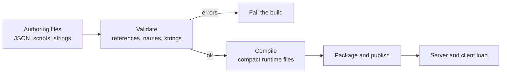
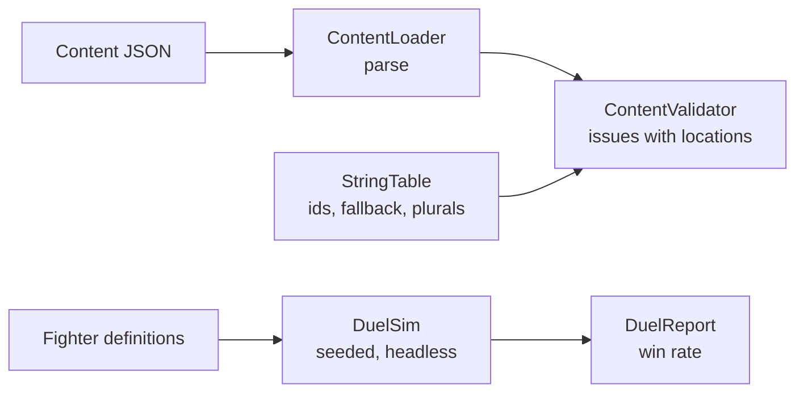

# Module 24: Content pipeline, localisation and testing

- **Goal:** understand how game content travels from an author's file to the running game, how text is localised, and how a game is tested when most of it is data and chance; then build a content validator, a string table and a reproducible balance simulation.
- **Prerequisites:** [05 Data-driven design and property systems](05-data-properties.md), [06 Scripting](06-scripting.md), [08 Stats and combat resolution](08-stats-combat.md).
- **Example:** `examples/24-pipeline/` (`dotnet test examples/24-pipeline`)
- **Facts checked:** October 2026 (prices, licences and product status change; re-check before reuse)

## In short

A live RPG is mostly content: thousands of items, skills, monsters, maps and strings, edited by many people for years. Most outages caused by content are boring: a typo in a reference, a renamed script, a missing translation. The cure is a **pipeline**: authors edit friendly text files, a build step validates them (every reference must resolve) and converts them to a compact runtime form, and CI refuses a bad change. The main design choices are the authoring format, how text is localised and how much of the game is covered by automated tests. The example builds a validator, a string table with placeholders and plurals, and a seeded duel simulator that produces an exactly reproducible win rate.

## 1. The concept

### 1.1 Authoring format and runtime format

The format that is pleasant to **edit** is rarely the one that is best to **load**.

| | Authoring format | Runtime format |
|---|---|---|
| Goal | Easy to read, diff and review | Fast to load, small, hard to corrupt |
| Typical | JSON, YAML, XML, spreadsheets, scripts | Binary table, memory-mapped file, packed bundle |
| Who touches it | Designers, writers | The game only |
| Checked | By the build | Trusted at load |

A **build step** converts one into the other. During development the game may load the authoring files directly, so a designer sees a change at once; in release it loads only the compiled form. Region or test variants can ship as small **overlays**: a base table plus a patch file with the rows that differ.



### 1.2 Build-time validation

Most content bugs are broken **references**: a monster drops an item that was deleted, an item grants a skill that was renamed, a door warps to a map that does not exist. A validator catches them before players do. The useful checks, in order of value:

1. **Reference integrity.** Every id used anywhere must exist where it points.
2. **Unique ids.** Two rows with the same id silently overwrite each other.
3. **Naming rules.** An id like `item.iron_sword` can be checked mechanically. Naming rules also make string-keyed dispatch safe: "every handler name a table mentions has a registered handler".
4. **Ranges and invariants.** Probabilities within 0 to 1, positive costs, spawn points inside the map.
5. **Missing text.** Every string key the data mentions exists in the base language.
6. **Unused data.** Fields and rows that nothing reads. Dead data accumulates quietly and misleads designers.

Two design rules make this work. Report the **location** of each problem ("items[item.staff].skill") so an author can fix it without searching. And run the validator on **what the game actually loads**, using the same parser, so the check cannot drift from reality.

### 1.3 Localisation

**Localisation** (l10n) means a game can show its text in several languages. The standard design is simple.

- Code and data hold **string ids**, never sentences. The sentence lives in a per-language table.
- The table lookup has a **fallback language**: if a translation is missing, show the base language, and as a last resort show the id in brackets so the gap is visible.
- Text contains **placeholders** ("Hello, {name}!") because word order differs between languages, so you never build sentences by gluing pieces.
- **Plurals and variants** need their own entries. English has two forms (one coin, two coins). Other languages have more, and gender or case may matter. Give each variant a key and let the lookup choose by a count or a flag. Standard libraries (ICU message format, Fluent, gettext) cover the full rules; a small game can start with `one` and `other`.
- Keep in mind **fonts** (the character set must cover the language), **text length** (German and Vietnamese often run longer than English), and **dates, numbers and currencies**.

### 1.4 Testing a game

Games are hard to test because they are interactive, random and visual. The answer is to push as much as possible into layers that are not.

| Layer | What it tests | How |
|---|---|---|
| **Rules unit tests** | Formulas, state machines, inventories | Plain xUnit with concrete numbers (modules 08 to 15) |
| **Deterministic replays** | A recorded input sequence yields the same final state | Fixed tick, injected seeded RNG (module 03); turn every found bug into a replay |
| **Headless simulation** | Balance: win rates, economy flows, progression pace | Run thousands of seeded matches or days of play and read the numbers |
| **Content validation** | Data is consistent | A CI step on every content change |
| **Integration and bots** | Server, protocol and persistence together | Bot clients against a real server (module 17) |
| **Load tests** | Capacity | Many bots; watch tick time |
| **Playtests** | Fun, clarity | People; no substitute |

A **balance simulation** is a unit test on a population: it does not prove the game is fun, but it catches the class that is worth catching, such as "class A beats class B nine times out of ten".

## 2. The design space

### 2.1 Authoring format

| Option | Fit | Cost |
|---|---|---|
| **Spreadsheets** (CSV, Google Sheets) | Designer-heavy teams, flat tables | No structure for nested data; merge conflicts; needs export tooling |
| **JSON or YAML in version control** | Small and mid teams; reviewable diffs | Hand-edited references break easily without a validator |
| **XML or custom text tables** | Long-lived in-house engines | Verbose; tooling must be written |
| **Engine assets** (ScriptableObjects, Data Assets, Resources) | Teams living inside an editor | Tied to the engine; harder to validate outside it |
| **A database with an editor UI** | Large live teams with many non-programmers | A tool to build and maintain; needs export and review flow |

### 2.2 Localisation

| Approach | How | Fit |
|---|---|---|
| **Key-based string tables** | Data holds ids; a table per language holds sentences | Most games; this module's example |
| **Numbered dictionary** | Entries keyed by integers | Very large games; ids carry no meaning, so tooling is essential |
| **Library formats** (ICU, Fluent, gettext) | Full plural, gender and case rules | Languages with several plural forms, or heavy dynamic text |
| **Machine translation with review** | Draft by tool, human check | Fast iteration; quality gates needed |

### 2.3 Testing

- **A single-character action RPG** leans on replays of recorded input and combat unit tests, because moment-to-moment feel matters.
- **A party or MMO** adds balance simulations across many class and skill combinations, plus bot-driven load tests.
- **Any game** needs content validation in CI.

### 2.4 How to choose

| If your team... | Prefer |
|---|---|
| Is small and technical | JSON plus a schema and a validator in CI |
| Has many designers | A spreadsheet or editor export that feeds the same validator |
| Ships in several languages | String ids, a fallback language, and a library for rich plurals |
| Has random combat | Seeded simulations with golden results |
| Runs a live service | A required CI step: validate content, run simulations |

## 3. Trade-offs and pitfalls

- **No tests for the rules.** If combat and AI formulas have no automated checks, balance regressions are found by players.
- **Numeric string ids carry no meaning.** A reviewer cannot tell what entry 48213 says without a lookup, and ids from different regional dictionaries drift apart over the years. Prefer readable keys.
- **Checks written one at a time.** If nothing declares "this column references that table", coverage depends on discipline. Drive checks from a schema.
- **Dead data piles up.** Fields stay in tables after the logic that read them was removed. Add an unused-data check.
- **A validator that drifts from the game.** Validate through the real loader, not a parallel parser.
- **Flaky random tests.** Unseeded randomness makes failures unrepeatable; always inject a seeded generator.
- **Tests as separate projects with no common runner.** Tests that nobody runs on every change protect nothing.

## 4. Build or buy

### 4.1 What engines and libraries give you

| Need | Unreal | Unity | Godot | Libraries |
|---|---|---|---|---|
| Asset import and cooking | Cooker, packaged bundles | Importers, Addressables | Resource import, PCK packs | none needed |
| Data tables | Data Tables, Data Assets | ScriptableObjects | Resources | JSON or a schema |
| Localisation | String tables, gather and export tools | Localization package | Translation files, `tr()` | ICU, Fluent, gettext |
| Validation | Data validation hooks in the editor | Editor scripts | Editor plugins | JSON Schema |
| Test frameworks | Automation system, functional tests | Test Framework | Add-ons | xUnit, NUnit |

Engines give strong **import, packaging and editor integration**. They do not know your game's rules, so **cross-table validation, balance simulation and replay tests are always yours**.

### 4.2 Could we build it ourselves today?

Yes, and it is the cheapest high-value investment in the course.

| Piece | Effort | Risk |
|---|---|---|
| Schema-checked JSON authoring with a loader | Days | Low |
| Cross-reference validator in CI | 1 to 2 weeks to cover all tables | Low; grows with content |
| Binary or bundled runtime format | Days to a week; only when load time measurably hurts | Low |
| String table with fallback, placeholders and plurals | Days; use ICU or Fluent when more than two plural forms matter | Low |
| Headless simulation for balance | 1 to 2 weeks per system | Medium: the sim must use the same rules code as the game |
| Replay test harness | Falls out of a deterministic tick (module 03) | Low if determinism was designed in |

AI-assisted development helps most here: writing validators per table, translating string tables, and generating test cases from a rules spec are all well-bounded tasks. What a PoC must prove: that one broken reference fails CI with a useful location; that a second language can be added without code changes; and that a seeded simulation gives byte-identical results on two machines.

### 4.3 Verdict

**Build.** Use an open schema or library for the parts that are solved (JSON Schema, ICU or Fluent for rich plurals, xUnit), and write the cross-reference validator and the balance simulations yourself, because they encode your game's rules. Make "validate content" a required CI step from the first week.

## 5. The example

### 5.1 Design

Four small parts, each separate and each with tests.



### 5.2 The content validator

`ContentLoader` reads the authoring JSON into three tables: skills, items and monsters. `ContentValidator.Validate(content, strings, baseLanguage)` returns a list of `Issue(Severity, Location, Message)`. The checks are the first five from section 1.2: unique ids, an id pattern `kind.lower_snake_case`, references (an item's skill, a monster's drops), a positive power, and string keys that exist in the base language.

The key test authors an item that uses a skill that does not exist:

```csharp
Assert.Contains(issues, i => i.Location == "items[item.staff].skill"
                          && i.Message == "unknown skill 'skill.fireball'");
```

and a monster whose second drop is unknown, reported at `monsters[monster.wolf].drops[1]`. The sample data holds exactly those two errors, and a test asserts the total is 2, so the validator neither misses a real problem nor invents one. Further tests cover duplicates (`skills[skill.a]` "duplicate id"), a badly cased id, a missing string, and `power` of 0.

### 5.3 The string table

`StringTable` stores `language -> id -> text`. `Get(language, id, args)`:

1. looks up the language; if `args` has a `count`, it first tries `id.one` or `id.other`;
2. falls back to the fallback language;
3. returns `[id]` if nothing is found;
4. replaces `{name}` placeholders, and leaves unknown placeholders as they are.

Tests with concrete values: `"Hello, {name}!"` with name Mira gives `"Hello, Mira!"`; count 1 gives `"You found 1 coin."`, count 5 and count 0 give `"You found 5 coins."` and `"You found 0 coins."`; a Vietnamese lookup for an English-only id returns the English text; an unknown id gives `"[nope]"`. The validator uses `Has`, which counts an id as present when it has an `.other` variant.

### 5.4 The balance simulator

`DuelSim.Run(a, b, duels, baseSeed)` plays `duels` fights. Duel number `i` uses `new Random(baseSeed + i)`, so every duel can be replayed alone, and the whole report is a function of its inputs. A hit deals `max(1, attack - defence)`, doubled on a crit (`rng.Next(100) < CritPercent`); A strikes first; a duel stops at 100 rounds as a draw.

Three kinds of test show how to test chance:

- **Remove the chance.** With no crits, A (attack 20) against B (attack 10) and equal HP of 100 wins all 1000 duels: `DuelReport(1000, 1000, 0, 0)`.
- **Pin a golden result.** A (HP 100, attack 15, defence 3, crit 30) against B (HP 120, attack 12, defence 5, crit 20), 1000 duels, seed 42, gives exactly 770 wins for A and 230 for B. If a rules change moves this number, the test fails and the change must be explained. (Seeded `System.Random` is stable across .NET versions; if you need a guarantee across platforms or libraries, own the generator, as module 03 does.)
- **Assert a band for symmetric cases.** A mirror match with 50% crits must produce a first-strike win rate between 0.45 and 0.70.

### 5.5 What the example leaves out

- A compiled runtime format. The loader reads the JSON directly; a real build would write a bundle after validation.
- Region overlays, unused-data detection and schema generation.
- ICU-grade plural rules for languages with more than two forms.
- Running the validator as a command-line tool for CI. It is a function; wrap it in a console project that exits with a non-zero code when any `Error` is returned.

## Key takeaways

- Separate the format authors edit from the format the game loads, and put a validating build step between them.
- Reference integrity, unique ids and naming rules catch most content bugs. Report the location of each problem.
- Validate with the real loader so the checker cannot drift from the game.
- Localise with string ids, a fallback language, placeholders and plural variants. Never glue sentences from pieces.
- Test a random game by removing the chance, pinning a seeded golden result, and asserting bands for symmetric cases.
- Make "validate content" a required CI step from the first week.
- Build all of this yourself: it encodes your rules and is cheap next to the outages it prevents.

## Further reading
- Unreal Engine documentation: Data Tables, Localization Dashboard.
- Unity documentation: Localization package, Addressables.
- Godot documentation: Internationalizing games, Resources.
- [Project Fluent](https://projectfluent.org) and the [ICU MessageFormat](https://unicode-org.github.io/icu/userguide/format_parse/messages/) specification.
- [JSON Schema](https://json-schema.org).
- Glenn Fiedler, ["Fix Your Timestep!"](https://gafferongames.com/post/fix_your_timestep/) and writings on deterministic simulation.
- Robert Nystrom, *Game Programming Patterns*, chapters on Data Locality and the Type Object pattern.
