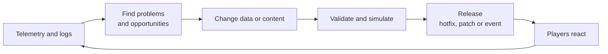

# Module 25: Live operations

- **Goal:** understand what running an online game after launch involves (patching, hotfixes, maintenance, events, balance, telemetry, economy, community) and what a small team should build first.
- **Prerequisites:** [19 MMO server architecture](19-server-architecture.md), [24 Content pipeline, localisation and testing](24-pipeline-testing.md), [14 Items, economy and rewards](14-items-economy.md), [15 Quests, missions and instances](15-quests-missions.md).
- **Example:** none
- **Facts checked:** October 2026 (prices, licences and product status change; re-check before reuse)

## In short

Launch is the start of the job. An online game is a service: it must be updated without losing players' trust, kept fair as power accumulates, and kept interesting as content runs out. The tools are well known: a patching path for clients, a hot-reload path for the server, scheduled maintenance, events that are data and not code, telemetry that tells you what players actually do, and an audit log that lets you undo mistakes. The lessons are as much about restraint as tooling: protect the core, never re-gate earned progress and keep power growth simple.

## 1. The concept

### 1.1 Three kinds of change

Every update falls into one of three kinds, and each has a different cost.

| Kind | Examples | Needs a client download? | Needs server downtime? |
|---|---|---|---|
| **Content update** | New quests, items, maps, events | Often (assets), sometimes only data | Usually a short restart |
| **Hotfix** | A broken drop table, a bad price, an exploit | Rarely | Ideally none: reload data or a script |
| **Engine or protocol update** | New opcodes, new rules | Yes, for everyone | Yes: client and server must match |

Design to push as many changes as possible from the third kind into the first two. Data and scripts that can be reloaded in a running server are the main tool for that (modules 05 and 06).

### 1.2 Patching and launchers

Most games ship a **launcher** or updater that checks a **manifest** (a list of files with hashes and sizes), downloads only the files that changed, verifies them, and then starts the game. Good launchers also check the protocol version at login (module 17), so an outdated client is told to update rather than crashing. Modern practice is **content delivery networks** for downloads, **delta patches** for large assets, and for web clients, just a new page load. Plan for rollback: keep the previous build deployable.

### 1.3 Server maintenance windows

A **maintenance window** is a scheduled period when players are not served: a deployment, a database change, a restart. Practices that keep them short and boring:

- announce them in-game, ahead of time, with a countdown;
- a **rolling restart** by zone or shard when the architecture allows (module 19);
- compensation for long or unplanned downtime (players remember how you treat them);
- a written **runbook** for deploy and rollback, tried on a test environment first.

### 1.4 Events

An **event** is content with a start and an end: a seasonal quest, a double-experience weekend, a limited shop. Make events **data**: a definition with an active-from and active-to date, the content it enables, and its rewards. The server evaluates the date; no code change and no restart is needed to start or stop it. This also means events are testable in the same pipeline as everything else (module 24).

### 1.5 Balance over years

The first balance pass is easy. The hard part is the tenth. Each new class, item tier or skill interacts with all the old ones, and players have invested years in the old numbers. Habits that help:

- keep **headless balance simulations** (module 24) and run them for every change;
- change numbers in small steps, announce them with the reason, and write them down as **patch notes**;
- avoid nerfs that devalue what players paid time or money for; prefer raising the weak option;
- keep an explicit **power budget**: total sources of character power, so each new system has a place in the sum.

### 1.6 Telemetry and economy monitoring

You cannot run what you cannot see. **Telemetry** means recording gameplay events (login, level up, death, trade, purchase, quest done, quit) and aggregating them into dashboards.

| Question | Metric |
|---|---|
| Are players staying? | Day-1, day-7, day-30 retention; concurrent users |
| Where do they quit? | Last quest or zone before leaving |
| Is the content fun or a grind? | Time per level, deaths per zone, quest abandonment |
| Is the economy healthy? | Currency created vs destroyed ("faucets" and "sinks"), average wealth, price trends |
| Are we being exploited? | Spikes of items or currency from one source, repeat patterns, outlier accounts |

An **append-only event log** (module 20) is the base of all of these and of support: "what happened to this character?" becomes a query.

### 1.7 Power creep, monetisation pressure and trust

**Power creep** is when each new release must be stronger than the last to sell, until old content is trivial and new players are hopelessly behind. It usually arrives as **new layers** (another gear slot, another upgrade ladder) instead of rebalancing the old. **Monetisation pressure** is when revenue targets push design toward gated progress or random draws on power. Both erode **trust**, which is the real asset of a long-running game. Practices: no random chance stacked on top of random chance for power; never re-lock progress players already earned; let new players catch up; keep paid power and free power in one honest budget.

### 1.8 Community

Players are the other half of operations. Keep a steady channel: patch notes, developer posts, a known place for bug reports and a fair, documented policy for bans and appeals. Moderate chat. Treat the player economy as something to protect (anti-fraud, anti-bot), because trades and markets are where the community lives.

## 2. The design space

### 2.1 How updates reach players

| Option | Fit | Cost |
|---|---|---|
| **Web client** | Browser games | Always current; limited by the browser |
| **Store-managed patching** (Steam, Epic, mobile stores) | Most PC and mobile titles | Store review delays, platform rules and revenue share (as of October 2026) |
| **Own launcher with manifest and CDN** | Games outside stores, big downloads | You build and run the updater |

### 2.2 Maintenance model

| Model | How | Fit |
|---|---|---|
| **Scheduled downtime** | Regular weekly window | Simple architectures, single-shard worlds |
| **Rolling restart** | Zone by zone or shard by shard | Multi-process servers |
| **Zero-downtime deploys** | Run old and new side by side, drain sessions | Cloud-native services with compatible protocols |

### 2.3 Events and content cadence

- **A single-character action RPG** often ships seasons and battle passes on a fixed cadence.
- **A party or squad MMO** often adds new characters and power layers; keep the roster manageable, or most of it is forgotten.
- Either way, define events as data with dates, reuse the quest or mission framework, and keep content within the pipeline of module 24.

### 2.4 Monetisation and trust

| Model | Pressure it creates |
|---|---|
| **Subscription** | Pressure to keep players logged in; low pressure to sell power |
| **Buy-to-play with expansions** | Pressure to ship big content drops |
| **Free-to-play** | Strongest pressure to gate progress or sell random power; needs explicit design rules |

### 2.5 How to choose

| If your game... | Prefer |
|---|---|
| Is a small team's first live game | Store patching, scheduled downtime, data-driven events |
| Has a player-run economy | Faucet and sink telemetry, an audit log, no re-gating of earned progress |
| Is free-to-play | A written power budget and a rule against stacked randomness on power before launch |
| Has hundreds of characters or items | Limit the roster, or give each addition a clear role |

## 3. Trade-offs and pitfalls

- **Power creep through layers.** Each era adds a new slot or ladder on top of the last; old systems are not rebalanced and new players face a steep wall.
- **Stacked randomness on power** frustrates players and is hard to remove once it exists.
- **Re-gating earned progress behind payment** is a trust-breaking moment players remember for years.
- **Reactive economy hardening.** Guard rails added after exploits mean the first exploit is expensive; add telemetry and audit logs before launch.
- **Dead data.** Fields stay in tables after the logic that read them is gone.
- **Reward curves that favour front-runners.** A very top-heavy leaderboard and super-linear milestone points reward the already-advanced the most.
- **Slow, partial delivery of announced fixes** teaches players to stop trusting announcements.
- **Roster scale.** Hundreds of characters mean many are forgotten or exist only to be sold.

## 4. Build or buy

### 4.1 What engines and platforms give you

Engines give very little here: Unreal, Unity and Godot are build-time tools. Live operations come from services and standard infrastructure.

| Need | Commonly available (as of October 2026) |
|---|---|
| Patch delivery | Platform stores and launchers (Steam, Epic, mobile stores) with built-in delta patching; or a CDN and your own manifest |
| Server hosting and scaling | Cloud virtual machines, Kubernetes, game-server orchestration platforms |
| Telemetry | Engine analytics SDKs, hosted analytics, or an open pipeline (event log into PostgreSQL or a columnar store, dashboards in Grafana or Metabase) |
| Remote config, feature flags | Hosted services, or a table in your own database |
| Crash reporting | Hosted crash services, open-source collectors |
| Player support, community | Ticketing tools, chat and forum platforms |

### 4.2 Could we build it ourselves today?

| Piece | Verdict | Effort | Risk |
|---|---|---|---|
| Launcher or web deploy | Use the platform's, or a plain manifest and a CDN | Days to weeks | Low |
| Data and script hot reload | Build (it follows from data-driven design) | Weeks | Medium: reloads must be atomic and validated |
| Event definitions as data with date gates | Build | Days | Low |
| Event and audit log | Build in the same transaction as the state change | Days | Low |
| Dashboards | Use open tools on the log | Days to weeks | Low |
| Ops console | Start with a command line and runbooks; add a web UI later | Weeks | Low |
| Anti-fraud and bot detection | Start with simple rules on the log | Ongoing | Medium |

What a PoC must prove: a data change validated in CI goes live on a test server without a restart, with a one-command rollback; an event starts and stops itself on its dates; and a question like "how much of currency X was created yesterday, from which source?" is answered by a single query.

### 4.3 Verdict

**Build the thin layer that follows your architecture** (hot reload, date-gated events, the audit log). **Use standard services** for delivery, hosting, dashboards and crash reports. The best investment is a **design rule set** set before launch: a power budget, no stacked randomness on power, no re-gating, and flat reward curves. Tools cannot fix those later.

## Key takeaways

- Updates are content, hotfix or engine/protocol changes. Move as much as possible into data and scripts that can be reloaded.
- Make events data: a definition with dates, the content it turns on, and rewards.
- A hot-reload path is the best hotfix tool. An append-only log is the best audit tool.
- Telemetry and economy monitoring (faucets and sinks) must exist before launch, not after the first exploit.
- Power creep comes from stacking new layers. Keep a power budget, prefer one deep system to many shallow ones, and keep reward curves flat.
- Trust is the asset: never re-gate earned progress, never stack random chance on power, deliver announced fixes.
- Use platforms for delivery and hosting; build only the thin layer your architecture needs.

## Further reading

- Raph Koster, *A Theory of Fun for Game Design* and his writings on online game economies.
- Edward Castronova, *Synthetic Worlds* on virtual economies.
- GDC talks on live operations and economy design (search the GDC Vault for "live ops" and "MMO economy").
- Google, [*Site Reliability Engineering*](https://sre.google/books/) (free online): runbooks, incident handling, rollouts.
- Martin Fowler, ["Event Sourcing"](https://martinfowler.com/eaaDev/EventSourcing.html) and ["Feature Toggles"](https://martinfowler.com/articles/feature-toggles.html).
- Grafana, Metabase and PostgreSQL documentation for building dashboards on an event log.
